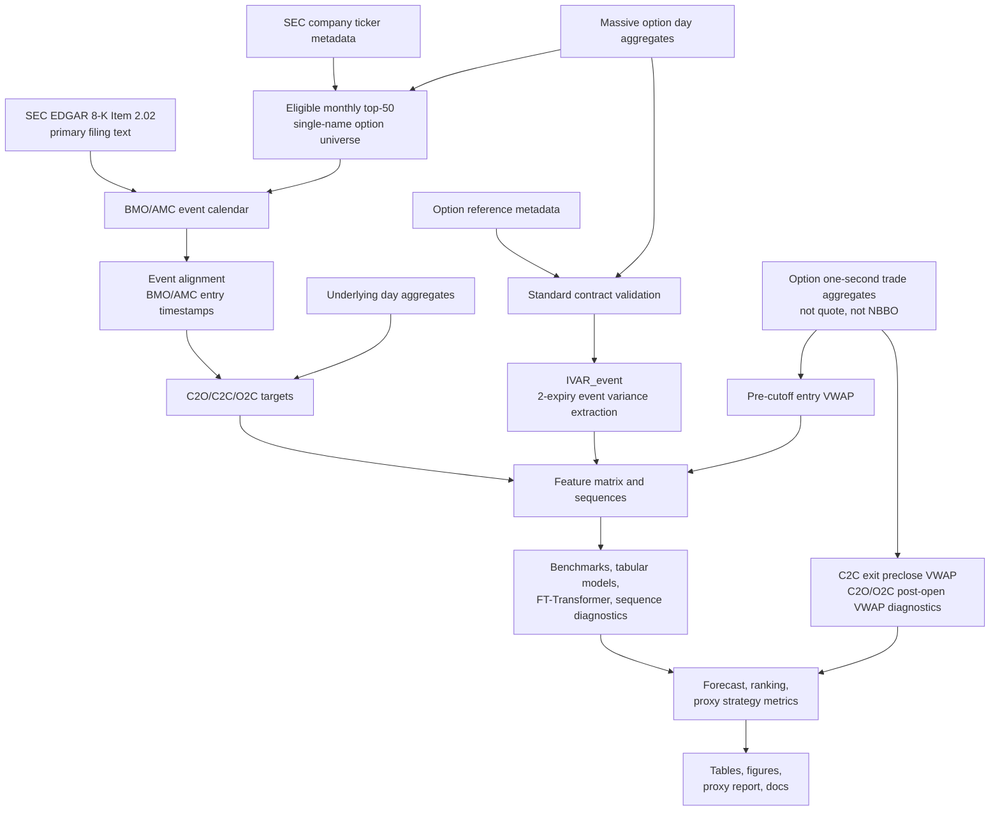

---
hide:
  - navigation
---

# Manuscript Skeleton

Working title:

**Can Machine Learning Improve Earnings Event-Variance Trading? Evidence from
U.S. Equity Options**

This page is organized like a paper draft rather than a project plan. It keeps
the current evidence conservative: the results are based on a
`no_nbbo_trade_proxy` route and are not paper-grade executable trading results.

## Abstract

This paper asks whether machine-learning models can improve trading decisions
around option-implied earnings event variance mispricing. The object is not
generic implied-volatility forecasting. Models forecast realized earnings-event
variance, the market benchmark is option-implied event variance
`IVAR_event`, and the tradable question is whether predicted mispricing improves
premium-space trade selection after proxy transaction costs.

The current study uses a SEC-first earnings calendar and Massive market-data
proxy route for U.S. single-name equity options from 2022-12-01 through
2025-12-31. The sample contains 810 BMO/AMC earnings events, of which 693 have a
trade-proxy `IVAR_event`. The primary scientific target is close-to-open
earnings jump variance (`jump_c2o`); the V1 proxy-PnL headline is
close-to-close event variance (`day_c2c`); post-open digestion (`reaction_o2c`)
is diagnostic.

In the current 2026-05-12 canonical tuned proxy package, the default
`fe_v2_sec_xbrl` feature schema is not the sell: its strongest `jump_c2o` AUC is
the Goyal-Saretto-style spread at 0.602, and the positive `day_c2c` ridge-flat
sequence proxy PnL of about 19,918 USD remains diagnostic because the sequence
gate does not pass. The same-code `fe_v1_legacy` ablation is stronger:
LightGBM reaches `jump_c2o` AUC 0.677, XGBoost has best `jump_c2o` OOS R2
versus IVAR at 0.375, and LightGBM leads the `day_c2c` headline proxy strategy
at about 53,664 USD net PnL. `FT-Transformer` refers to the validation-tuned
tabular transformer specification; it trains but is not competitive.
`reaction_o2c` is modeled as a diagnostic target, but its post-open realized
variance is compared to full-event `IVAR_event`, so it is not a calibrated O2C
mispricing or headline strategy result. The legacy in-repo proxy-Mamba rows are
retired because they used a gated recurrent encoder rather than official
`mamba-ssm`. The defensible conclusion is that a parsimonious tabular feature
set shows preliminary cross-sectional ranking signal for earnings
event-variance mispricing in a no-NBBO proxy sample, while FE V2 is currently a
negative diagnostic result. Paper-grade claims require historical quote/NBBO or
equivalent data, quote-based IVAR, and leg-level execution with realistic
bid/ask crossing.

## 1. Introduction

Earnings announcements create scheduled jumps in uncertainty. Option prices
embed a market forecast of this event variance, but the central empirical
question is whether observable pre-event state and option-surface information
can improve the cross-sectional ranking of event variance mispricing.

The paper asks:

> Can models improve trading decisions around option-implied earnings event
> variance mispricing?

The realized-variance target system is:

```text
RVAR_event_jump_c2o     = log(open_after / close_before)^2
RVAR_event_day_c2c      = log(close_after / close_before)^2
RVAR_event_reaction_o2c = log(close_after / open_after)^2
```

The market baseline is:

```text
IVAR_event
```

The V1 tradable mispricing label is:

```text
RVAR_event_day_c2c - IVAR_event
```

The trade rule is evaluated in premium space:

```text
expected_strategy_edge_usd
  = expected_strategy_value_usd - market_entry_cost_usd
```

Forecast error is therefore only supporting evidence. The paper-facing result is
whether a model improves ranking, edge selection, and proxy net performance in
the tradable tail.

### Contribution

The contribution is not a model-family claim. The intended contribution is
narrower:

> State and event-history features contain preliminary cross-sectional signal
> for earnings event-variance mispricing beyond market-implied IVAR and simple
> historical baselines.

The model comparison is outcome-dependent. If the sequence suite passes the
diagnostic gate, ordered pre-event proxy-surface paths may contain incremental
information. If LightGBM/XGBoost win, event-level nonlinear tabular
interactions are sufficient for the current proxy data. If IVAR wins after
costs, the evidence supports a hard-to-beat earnings option market. The current
same-code ablation favors a parsimonious FE V1 tabular interpretation, not an
FE V2 or deep-sequence headline.

### Related Literature and Positioning

| Literature stream | Closest role in this paper |
| --- | --- |
| Earnings option pricing and scheduled jumps | Motivates separating event variance from total short-dated variance. |
| Earnings straddle-return studies | Motivates testing whether predicted event variance mispricing maps into option strategy returns. |
| RV-IV spread and option-return predictability | Provides required classical benchmarks, including Goyal-Saretto-style spread signals. |
| Empirical asset pricing with ML | Sets the discipline: out-of-sample ranking and economic value matter more than in-sample fit. |
| Surface and sequence models | Motivates FT-Transformer and official `mamba-ssm` diagnostics, but only after strong tabular baselines. |

The paper differs from average-return earnings straddle studies by asking
whether models sort events by expected event variance mispricing and whether
that sorting survives proxy costs.

## 2. Data

### 2.1 Sources and Execution Grade

The current data route uses official SEC filings for event identification and
Massive market-data proxies for prices:

- SEC EDGAR 8-K / 8-K/A Item 2.02 filings and SEC primary-document text
  validation.
- SEC company ticker metadata for eligible common-equity-like single-name
  underlyings.
- Massive options day aggregates for universe liquidity ranking, contract
  discovery, close-trade-implied IV proxies, and daily sequence features.
- Massive option contract reference metadata for multiplier and deliverable
  validation.
- Massive underlying day aggregates for event returns and vendor OHLC opens.
- Massive option one-second aggregates for entry prices, C2C exit marks, and
  C2O/O2C post-open diagnostic marks.
- FRED VIXCLS for prior-close daily market-state controls.

All current option second aggregates are trade OHLCV bars. They are not quote
midpoints, bid/ask records, OPRA, or NBBO. The current panel grade is
`no_nbbo_trade_proxy`; `paper_grade=false`.

### 2.2 Sample and Universe

The active proxy run covers 2022-12-01 through 2025-12-31. The target paper
range remains 2013-2025, but that requires upgraded historical option data or a
separate licensed route.

The single-name universe is dynamic. Each month, the pipeline ranks eligible
underlyings by trailing six-month option premium dollar volume:

```text
option_premium_dollar_volume = option_price * contract_volume * 100
```

ETF, fund, trust, ETN, index, volatility, commodity, and other non-single-name
symbols are excluded before the top-50 ranking. BMO and AMC events are retained;
DMH and unknown timing are excluded from the main sample.

### 2.3 Current Data Coverage

| Measure | Value |
| --- | ---: |
| Dynamic-calendar rows | 1,054 |
| BMO/AMC main-sample candidates | 810 |
| Trade-proxy event-panel rows | 810 |
| Events with C2C `rvar_event` alias | 801 |
| Events with trade-proxy `IVAR_event` | 693 |
| Proxy contract candidates | 12,038 |
| Contracts with usable pre-cutoff proxy price | 10,165 |
| Contracts with no trade in cutoff window | 1,873 |
| Contracts with local IV proxy | 10,138 |
| Main DTE 5-14 contracts | 5,098 |
| Robustness DTE 3-21 contracts | 12,038 |
| Proxy straddle diagnostic rows | 779 |

IVAR failure diagnostics:

| Failure reason | Events |
| --- | ---: |
| No two event-covering expiries | 103 |
| Nonmonotone total variance | 7 |
| Negative extracted IVAR | 7 |

The event panel is large enough for proxy-stage model comparison, but IVAR
coverage is still a material screen: 117 of 810 events lack a usable
trade-proxy IVAR.

## 3. Methods

### 3.1 Pipeline

The pipeline separates event discovery, market-data construction, feature
engineering, model training, and proxy backtesting. The diagram keeps the
execution caveat explicit: current prices are trade-aggregate proxies.



### 3.2 Event Alignment and Leakage Control

Feature construction uses a hard as-of gate:

```text
feature_asof_timestamp <= event_entry_timestamp
```

AMC events enter before the announcement-date close. BMO events enter before the
previous trading-day close. Vendor daily OHLC opens are used for C2O target
construction and labeled as vendor regular OHLC assumptions, not verified
auction prints.

### 3.3 IVAR Construction

For two event-covering expiries, total ATM implied variance is:

```text
w(T) = sigma_ATM(T)^2 * T
```

The implied event variance is extracted as:

```text
IVAR_event = (T2*w1 - T1*w2) / (T2 - T1)
```

Negative extracted event variance and nonmonotone total variance are excluded
from tradable samples and reported as diagnostics.

### 3.4 Features

The default research feature schema is `fe_v2_sec_xbrl`; `fe_v1_legacy` is kept
only for same-code ablations. The resolved run-level allowlist is
`artifacts/modeling/feature_schema_report.csv`, and only
`model_feature=true` rows enter trainable models. FE V2 removes raw numeric
identifiers, raw year/month, exit/outcome/PnL fields, and post-event labels
from the model matrix. The signal timestamp is `event_entry_timestamp`, so
completed pre-cutoff entry-window features are valid under the current
protocol.

The feature matrix combines event-level state, realized history, option-surface
proxies, market controls, and sequence inputs:

- `IVAR_event`, ATM IV, term spread, skew, butterfly/concavity proxies.
- Option activity and liquidity measures.
- RV5/RV20/RV60, last-four earnings history, and strict point-in-time
  same-ticker rolling earnings-history distributions.
- BMO/AMC timing and universe rank.
- Prior-close VIX level, changes, percentile, and regime.
- SPY/QQQ controls when available.
- SEC CompanyFacts XBRL fundamentals with conservative as-of gating:
  use `acceptanceDateTime <= feature_asof_timestamp` when mapped, otherwise
  allow only `filed < feature_asof_date`.
- Train-fitted cross-sectional z-score/rank transforms; locked-test
  distribution is never fit.
- Single-name 1/3/5/10-day run-up, weak delta-grid, and RND-like
  `*_proxy` features from trade-aggregate implied surfaces. These are not
  quote surfaces, NBBO surfaces, or paper-grade RND estimates.
- Daily 20-step close-trade-implied option-surface sequences.
- Hybrid 31-step sequences with 19 daily states and 12 entry-day five-minute
  trade-aggregate proxy bins.

Sequence coverage is 678 eligible events out of 810. The default drop rate is
16.3%, so sequence results are diagnostic in the current run.

### 3.5 Models

| Family | Models | Purpose |
| --- | --- | --- |
| Market benchmark | Market-implied IVAR | Central level and no-edge baseline. |
| Historical baselines | Last-four RVAR, last-four IVAR | Tests whether simple earnings history is enough. |
| Classical mispricing benchmark | Goyal-Saretto-style RV-IV spread | Required option-return predictability comparator. |
| Linear tabular | Elastic Net | Sparse linear event-level benchmark using sklearn `ElasticNetCV`. |
| Nonlinear tabular | LightGBM, XGBoost | Main current contenders with validation-only tuning. |
| Ensemble | LightGBM/XGBoost rank-average | Robustness ensemble built from tuned base forecasts. |
| Neural tabular | FT-Transformer | Validation-tuned deep tabular comparator. |
| Sequence diagnostics | Ridge-flat sequence aggregates, BiGRU 5-seed, official bidirectional `mamba-ssm` 5-seed, attention pooling, non-causal dilated CNN, mask-only and time-shuffle controls | Tests whether ordered pre-event paths add value. |

The canonical protocol is the tuned-only proxy protocol. Tuning
uses only train and locked-validation rows, selects on validation `jump_c2o`
predicted-edge AUC with top-decile precision and RMSE tie-breakers, then refits
on train+validation before a single locked-test evaluation. Paired original
tabular rows and single-seed BiGRU/Mamba rows are intentionally excluded from
the current artifacts.

The full sequence diagnostic suite is diagnostic-grade in the current sample.
It runs `jump_c2o`, `day_c2c`, and `reaction_o2c` for ridge-flat, BiGRU
5-seed, official `mamba-ssm` 5-seed, attention pooling, non-causal dilated CNN,
mask-only, and time-shuffle controls. The official Mamba wrapper is
bidirectional over completed pre-entry tokens and is therefore a non-causal
encoder of the pre-event path, not a post-entry leakage channel.

### 3.6 Splits, Strategy, and Metrics

The current proxy run uses chronological event-level 70/15/15 train,
validation, and test splits. The split unit is `event_id`, so C2O/C2C/O2C rows
for the same event cannot cross splits.

The V1 strategy headline is `day_c2c` only. Entry uses per-leg option VWAP over
the final 900 seconds before cutoff. The primary C2C exit uses same-contract
option VWAP over the final 15 minutes before the exit-date close. C2O and O2C
option-PnL rows are diagnostic decompositions.

Performance metrics:

| Metric family | Metrics |
| --- | --- |
| Forecast | MAE, RMSE, QLIKE diagnostic, OOS R2 versus IVAR |
| Ranking and mispricing | AUC, Brier, calibration, top-decile precision, edge-decile monotonicity |
| Strategy | Gross/net proxy PnL, return on premium/capital, Sharpe, Sortino, max drawdown, hit rate, average win/loss, cost sensitivity |
| Risk and coverage | IVAR failure counts, sequence drop rate, high sequence-selection risk, extreme prediction diagnostics |

## 4. Results

`paper_plan.md` is the manuscript skeleton, not the full result ledger. The
complete C2C/C2O/O2C tables, figures, diagnostics, and interpretation now live
in [Results Snapshot](results_snapshot.md). This section records the intended
paper-facing organization and the selected headline excerpt.

### 4.1 Feature-Schema Ablation Headline

The active default artifacts use `fe_v2_sec_xbrl`, but the same-code ablation is
negative for FE V2. Forecast and ranking columns below use `jump_c2o` unless
the target column states otherwise. Strategy columns use `day_c2c` only for the
headline proxy-PnL interpretation; C2O/O2C premium-space rows are diagnostic.

| Feature schema | Target | Best AUC model | Best AUC | Best OOS R2 model | Best OOS R2 vs IVAR | Best headline/diagnostic PnL model | Best net PnL |
|:---|:---|:---|---:|:---|---:|:---|---:|
| `fe_v1_legacy` | `jump_c2o` | LightGBM | 0.677 | XGBoost | 0.375 | Official `mamba-ssm` 5-seed, C2O intrinsic diagnostic | 28,898 |
| `fe_v1_legacy` | `day_c2c` | LightGBM | 0.925 | XGBoost | 0.574 | LightGBM, C2C headline | 53,664 |
| `fe_v1_legacy` | `reaction_o2c` | Ridge-flat sequence | 0.799 | XGBoost | 0.949 | FT-Transformer, O2C diagnostic | 643 |
| `fe_v2_sec_xbrl` | `jump_c2o` | Goyal-Saretto spread | 0.602 | LightGBM | 0.203 | Official `mamba-ssm` 5-seed, C2O intrinsic diagnostic | 28,898 |
| `fe_v2_sec_xbrl` | `day_c2c` | Ridge-flat sequence | 0.636 | Ridge-flat sequence | 0.264 | Ridge-flat sequence, C2C headline | 19,918 |
| `fe_v2_sec_xbrl` | `reaction_o2c` | Ridge-flat sequence | 0.799 | LightGBM/XGBoost ensemble | 0.945 | FT-Transformer, O2C diagnostic | 753 |

The central result is not that the richest feature schema wins. The current
paper-facing signal screen is the parsimonious FE V1 tabular result; FE V2,
FT-Transformer, and sequence rows remain diagnostic until follow-up feature
audits show otherwise.

### 4.2 Results Order for the Manuscript

The results section should be written in this order:

1. C2C: forecast/ranking table, premium-space proxy strategy table, edge-decile
   strategy figure, and interpretation. This is the only V1 proxy-PnL headline.
2. C2O: forecast/ranking table, forecast/ranking/calibration/monotonicity
   figures, post-open diagnostic strategy table, and interpretation. These rows
   support the scientific ranking story but are not headline execution claims.
3. O2C: forecast/ranking table, O2C forecast/ranking/strategy/scale figures,
   post-open premium-space diagnostic strategy table, scale-mismatch diagnostic,
   and interpretation. O2C is diagnostic because `IVAR_event` is a weak
   full-event comparator for post-open realized variance.
4. Sequence diagnostics: ridge-flat, BiGRU 5-seed, official bidirectional
   `mamba-ssm` 5-seed, attention pooling, non-causal dilated CNN, mask-only,
   and time-shuffle controls. The current
   conclusion is negative: ordered proxy-surface paths do not beat tabular
   aggregates or the controls.
5. Robustness and inference: cost sensitivity, clustered forecast-loss
   inference, calibration, and QLIKE caveats. These support a conservative
   tabular-model claim and do not replace quote/NBBO execution evidence.

## 5. Limitations

The current evidence is not final paper-grade executable evidence. The main
limitations are:

| Limitation | Consequence |
| --- | --- |
| No historical bid/ask, quote midpoint, OPRA, or NBBO records | Cannot claim full-spread executable strategy performance. |
| Option second aggregates are trade OHLCV bars | IV surfaces and strategy marks are trade-price proxies. |
| Current sample starts in 2022 | Does not yet cover the target 2013-2025 paper window. |
| 117 of 810 events lack usable trade-proxy IVAR | IVAR coverage is a material sample screen. |
| Sequence eligibility is 678 of 810 events | Sequence results carry selection risk and are diagnostic. |
| C2O/O2C option PnL is diagnostic | V1 tradable mispricing headline remains `day_c2c`. |
| Proxy haircut cost model | Full bid/ask crossing remains future paper-grade work. |

Paper-grade claims require historical quote/NBBO or equivalent data, quote-based
IVAR, leg-level execution with realistic bid/ask crossing, DTE and liquidity
robustness, and clustered or bootstrap inference.

## 6. Conclusion

The current proxy-stage evidence supports a disciplined, limited conclusion.
The same-code ablation says a parsimonious FE V1 tabular feature set improves
the ranking of earnings event-variance mispricing relative to market IVAR and
simple historical benchmarks, and maps this ranking signal into positive
`day_c2c` premium-space proxy economics. The richer FE V2 default is currently
a negative diagnostic result rather than a headline improvement.

The result is not a final execution claim. It is a credible signal-screening
result that justifies either a paper-grade quote/NBBO extension or a conservative
proxy-stage manuscript. If the next paper-grade route confirms the same ranking
and cost robustness under bid/ask execution, the sell is an earnings
event-variance mispricing paper. If it does not, the paper still has a useful
negative result: market-implied event variance and strong tabular baselines are
hard to beat under realistic earnings-option frictions.

## Appendix Plan

| Appendix | Contents |
| --- | --- |
| A. Literature and Positioning | Earnings option pricing, event volatility, option-return predictability, and ML comparisons. |
| B. Universe Construction | Monthly top-50 membership, turnover, exclusions, and liquidity distributions. |
| C. Event Calendar Audit | SEC accessions, timing flags, text validation, and BMO/AMC exclusions. |
| D. IVAR Diagnostics | Expiry selection, DTEs, total variances, negative IVAR, and nonmonotone failures. |
| E. Feature Schema | Event-level, VIX, SPY/QQQ, daily sequence, hybrid sequence, and as-of timestamps. |
| F. Model Configuration | Splits, hyperparameters, seeds, training status, and fit diagnostics. |
| G. Robustness and Inference | DTE windows, liquidity buckets, timing splits, ticker/year concentration, clustered SEs, and bootstrap checks. |
