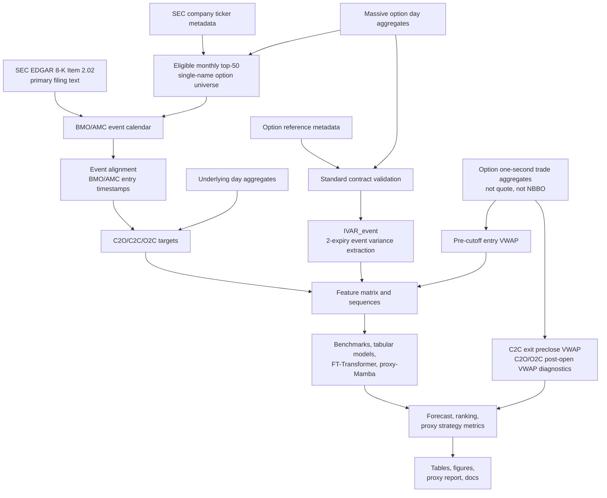

---
hide:
  - navigation
---

# Manuscript Skeleton

Working title:

**Can Machine Learning Improve Earnings Event-Variance Trading? Evidence from
U.S. Equity Options**

This page is organized like a paper draft rather than a project plan. It keeps
the current evidence conservative: the results are based on a
`no_nbbo_trade_proxy` route and are not paper-grade executable trading results.

## Abstract

This paper asks whether machine-learning models can improve trading decisions
around option-implied earnings event variance mispricing. The object is not
generic implied-volatility forecasting. Models forecast realized earnings-event
variance, the market benchmark is option-implied event variance
`IVAR_event`, and the tradable question is whether predicted mispricing improves
premium-space trade selection after proxy transaction costs.

The current study uses a SEC-first earnings calendar and Massive market-data
proxy route for U.S. single-name equity options from 2022-12-01 through
2025-12-31. The sample contains 810 BMO/AMC earnings events, of which 693 have a
trade-proxy `IVAR_event`. The primary scientific target is close-to-open
earnings jump variance (`jump_c2o`); the V1 proxy-PnL headline is
close-to-close event variance (`day_c2c`); post-open digestion (`reaction_o2c`)
is diagnostic.

In the current proxy run, XGBoost has the strongest `jump_c2o` ranking result
with AUC 0.781 and edge-decile Spearman 0.927. LightGBM produces the strongest
`day_c2c` net proxy PnL, about 69,908 USD, followed by XGBoost at about
68,344 USD. Daily and hybrid proxy-Mamba variants are implemented but are not
headline results because sequence coverage has selection risk and current
economic performance is weak. The defensible conclusion is that nonlinear
tabular models show preliminary cross-sectional ranking signal for earnings
event-variance mispricing in a no-NBBO proxy sample. Paper-grade claims require
historical quote/NBBO or equivalent data, quote-based IVAR, and leg-level
execution with realistic bid/ask crossing.

## 1. Introduction

Earnings announcements create scheduled jumps in uncertainty. Option prices
embed a market forecast of this event variance, but the central empirical
question is whether observable pre-event state and option-surface information
can improve the cross-sectional ranking of event variance mispricing.

The paper asks:

> Can models improve trading decisions around option-implied earnings event
> variance mispricing?

The realized-variance target system is:

```text
RVAR_event_jump_c2o     = log(open_after / close_before)^2
RVAR_event_day_c2c      = log(close_after / close_before)^2
RVAR_event_reaction_o2c = log(close_after / open_after)^2
```

The market baseline is:

```text
IVAR_event
```

The V1 tradable mispricing label is:

```text
RVAR_event_day_c2c - IVAR_event
```

The trade rule is evaluated in premium space:

```text
expected_strategy_edge_usd
  = expected_strategy_value_usd - market_entry_cost_usd
```

Forecast error is therefore only supporting evidence. The paper-facing result is
whether a model improves ranking, edge selection, and proxy net performance in
the tradable tail.

### Contribution

The contribution is not "Mamba predicts IV better." The intended contribution is
narrower:

> State and event-history features contain preliminary cross-sectional signal
> for earnings event-variance mispricing beyond market-implied IVAR and simple
> historical baselines.

The model comparison is outcome-dependent. If Mamba wins, pre-event sequence
dynamics matter. If LightGBM/XGBoost win, event-level nonlinear tabular
interactions are sufficient for the current proxy data. If IVAR wins after
costs, the evidence supports a hard-to-beat earnings option market. The current
proxy result favors the tabular nonlinear interpretation, not a deep-sequence
headline.

### Related Literature and Positioning

| Literature stream | Closest role in this paper |
| --- | --- |
| Earnings option pricing and scheduled jumps | Motivates separating event variance from total short-dated variance. |
| Earnings straddle-return studies | Motivates testing whether predicted event variance mispricing maps into option strategy returns. |
| RV-IV spread and option-return predictability | Provides required classical benchmarks, including Goyal-Saretto-style spread signals. |
| Empirical asset pricing with ML | Sets the discipline: out-of-sample ranking and economic value matter more than in-sample fit. |
| Surface and sequence models | Motivates FT-Transformer and proxy-Mamba comparisons, but only after strong tabular baselines. |

The paper differs from average-return earnings straddle studies by asking
whether models sort events by expected event variance mispricing and whether
that sorting survives proxy costs.

## 2. Data

### 2.1 Sources and Execution Grade

The current data route uses official SEC filings for event identification and
Massive market-data proxies for prices:

- SEC EDGAR 8-K / 8-K/A Item 2.02 filings and SEC primary-document text
  validation.
- SEC company ticker metadata for eligible common-equity-like single-name
  underlyings.
- Massive options day aggregates for universe liquidity ranking, contract
  discovery, close-trade-implied IV proxies, and daily sequence features.
- Massive option contract reference metadata for multiplier and deliverable
  validation.
- Massive underlying day aggregates for event returns and vendor OHLC opens.
- Massive option one-second aggregates for entry prices, C2C exit marks, and
  C2O/O2C post-open diagnostic marks.
- FRED VIXCLS for prior-close daily market-state controls.

All current option second aggregates are trade OHLCV bars. They are not quote
midpoints, bid/ask records, OPRA, or NBBO. The current panel grade is
`no_nbbo_trade_proxy`; `paper_grade=false`.

### 2.2 Sample and Universe

The active proxy run covers 2022-12-01 through 2025-12-31. The target paper
range remains 2013-2025, but that requires upgraded historical option data or a
separate licensed route.

The single-name universe is dynamic. Each month, the pipeline ranks eligible
underlyings by trailing six-month option premium dollar volume:

```text
option_premium_dollar_volume = option_price * contract_volume * 100
```

ETF, fund, trust, ETN, index, volatility, commodity, and other non-single-name
symbols are excluded before the top-50 ranking. BMO and AMC events are retained;
DMH and unknown timing are excluded from the main sample.

### 2.3 Current Data Coverage

| Measure | Value |
| --- | ---: |
| Dynamic-calendar rows | 1,054 |
| BMO/AMC main-sample candidates | 810 |
| Trade-proxy event-panel rows | 810 |
| Events with C2C `rvar_event` alias | 801 |
| Events with trade-proxy `IVAR_event` | 693 |
| Proxy contract candidates | 12,038 |
| Contracts with usable pre-cutoff proxy price | 10,165 |
| Contracts with no trade in cutoff window | 1,873 |
| Contracts with local IV proxy | 10,138 |
| Main DTE 5-14 contracts | 5,098 |
| Robustness DTE 3-21 contracts | 12,038 |
| Proxy straddle diagnostic rows | 779 |

IVAR failure diagnostics:

| Failure reason | Events |
| --- | ---: |
| No two event-covering expiries | 103 |
| Nonmonotone total variance | 7 |
| Negative extracted IVAR | 7 |

The event panel is large enough for proxy-stage model comparison, but IVAR
coverage is still a material screen: 117 of 810 events lack a usable
trade-proxy IVAR.

## 3. Methods

### 3.1 Pipeline

The pipeline separates event discovery, market-data construction, feature
engineering, model training, and proxy backtesting. The diagram keeps the
execution caveat explicit: current prices are trade-aggregate proxies.



### 3.2 Event Alignment and Leakage Control

Feature construction uses a hard as-of gate:

```text
feature_asof_timestamp <= event_entry_timestamp
```

AMC events enter before the announcement-date close. BMO events enter before the
previous trading-day close. Vendor daily OHLC opens are used for C2O target
construction and labeled as vendor regular OHLC assumptions, not verified
auction prints.

### 3.3 IVAR Construction

For two event-covering expiries, total ATM implied variance is:

```text
w(T) = sigma_ATM(T)^2 * T
```

The implied event variance is extracted as:

```text
IVAR_event = (T2*w1 - T1*w2) / (T2 - T1)
```

Negative extracted event variance and nonmonotone total variance are excluded
from tradable samples and reported as diagnostics.

### 3.4 Features

The feature matrix combines event-level state, realized history, option-surface
proxies, market controls, and sequence inputs:

- `IVAR_event`, ATM IV, term spread, skew, butterfly/concavity proxies.
- Option activity and liquidity measures.
- RV5/RV20/RV60 and last-four earnings history.
- BMO/AMC timing and universe rank.
- Prior-close VIX level, changes, percentile, and regime.
- SPY/QQQ controls when available.
- Daily 20-step close-trade-implied option-surface sequences.
- Hybrid 31-step sequences with 19 daily states and 12 entry-day five-minute
  trade-aggregate proxy bins.

Sequence coverage is 678 eligible events out of 810. The default drop rate is
16.3%, so sequence results are diagnostic in the current run.

### 3.5 Models

| Family | Models | Purpose |
| --- | --- | --- |
| Market benchmark | Market-implied IVAR | Central level and no-edge baseline. |
| Historical baselines | Last-four RVAR, last-four IVAR | Tests whether simple earnings history is enough. |
| Classical mispricing benchmark | Goyal-Saretto-style RV-IV spread | Required option-return predictability comparator. |
| Linear tabular | Elastic Net | Sparse linear event-level benchmark. |
| Nonlinear tabular | LightGBM, XGBoost | Main current contenders. |
| Neural tabular | FT-Transformer | Deep tabular comparator. |
| Sequence models | Daily proxy-Mamba, hybrid proxy-Mamba, intraday-only Mamba, mask-only hybrid Mamba | Tests whether ordered pre-event paths add value. |

Mamba variants use a q=0.5 quantile loss on log-transformed realized variance
with `forecast_floor=1e-6`. Forecasts are transformed back to variance space
before all ranking and economic metrics.

### 3.6 Splits, Strategy, and Metrics

The current proxy run uses chronological event-level 70/15/15 train,
validation, and test splits. The split unit is `event_id`, so C2O/C2C/O2C rows
for the same event cannot cross splits.

The V1 strategy headline is `day_c2c` only. Entry uses per-leg option VWAP over
the final 900 seconds before cutoff. The primary C2C exit uses same-contract
option VWAP over the final 15 minutes before the exit-date close. C2O and O2C
option-PnL rows are diagnostic decompositions.

Performance metrics:

| Metric family | Metrics |
| --- | --- |
| Forecast | MAE, RMSE, QLIKE diagnostic, OOS R2 versus IVAR |
| Ranking and mispricing | AUC, Brier, calibration, top-decile precision, edge-decile monotonicity |
| Strategy | Gross/net proxy PnL, return on premium/capital, Sharpe, Sortino, max drawdown, hit rate, average win/loss, cost sensitivity |
| Risk and coverage | IVAR failure counts, sequence drop rate, high sequence-selection risk, extreme prediction diagnostics |

## 4. Results

### 4.1 Main Result Table

Forecast and ranking columns use `jump_c2o`. Strategy columns use `day_c2c`, the
only V1 proxy-PnL headline.

| Model | MAE | RMSE | OOS R2 vs IVAR | Top-decile precision | AUC | Day-C2C net proxy PnL |
|:---|---:|---:|---:|---:|---:|---:|
| Market IVAR | 0.0097 | 0.0145 | 0.000 | 0.000 | 0.500 | n/a |
| Goyal-Saretto spread | 0.0076 | 0.0134 | 0.141 | 0.300 | 0.602 | -461 |
| Elastic Net | 0.0095 | 0.0213 | 0.323 | 0.500 | 0.629 | 47,938 |
| LightGBM | 0.0077 | 0.0192 | 0.355 | 0.500 | 0.745 | 69,908 |
| XGBoost | 0.0074 | 0.0191 | 0.380 | 0.500 | 0.781 | 68,344 |
| FT-Transformer | 0.0374 | 0.0396 | -5.487 | 0.200 | 0.525 | -4,793 |
| Daily Mamba 20-step | 0.0067 | 0.0136 | 0.106 | 0.111 | 0.495 | -9,370 |
| Hybrid Mamba 31-step | 0.0082 | 0.0228 | 0.194 | 0.100 | 0.498 | -35 |
| Intraday-only Mamba 12-step | 0.0083 | 0.0228 | 0.192 | 0.100 | 0.498 | -35 |
| Mask-only hybrid Mamba | 0.0088 | 0.0242 | -0.036 | 0.100 | 0.500 | 101 |

The central result is not that the lowest MAE model wins economically. Daily
Mamba has the lowest `jump_c2o` MAE, but XGBoost and LightGBM produce the best
ranking and proxy economic results.

### 4.2 Forecast Accuracy


**Interpretation.** Forecast error is useful but not decisive. XGBoost leads the
reported `jump_c2o` OOS R2 versus IVAR, while daily Mamba has the lowest MAE.
The split between forecast accuracy and economic value is why the paper does not
claim that lower RMSE alone proves tradability.

### 4.3 Ranking Quality


**Interpretation.** Ranking quality is closer to the paper's question than level
forecast accuracy. XGBoost leads AUC at 0.781; Elastic Net, LightGBM, and
XGBoost each reach 0.500 top-decile precision on the current proxy test rows.
The market IVAR baseline is neutral in ranking because it generates no positive
premium edge against itself.

### 4.4 Mispricing Monotonicity


**Interpretation.** A useful mispricing model should sort realized mispricing
monotonically across predicted-edge buckets. XGBoost has the strongest
edge-decile Spearman relationship in the current run, consistent with the
ranking evidence.

### 4.5 Proxy Strategy Performance


Selected `day_c2c` proxy strategy metrics:

| Model | Trades | Net proxy PnL | Return on premium | Sharpe | Max drawdown |
|:---|---:|---:|---:|---:|---:|
| Last-four RVAR | 100 | -3,482 | -0.021 | -0.268 | -16,789 |
| Last-four IVAR | 100 | -15,904 | -0.094 | -1.235 | -16,132 |
| Goyal-Saretto spread | 100 | -461 | -0.003 | -0.036 | -17,145 |
| Elastic Net | 100 | 47,938 | 0.283 | 4.007 | -3,202 |
| LightGBM | 100 | 69,908 | 0.413 | 6.476 | -1,416 |
| XGBoost | 100 | 68,344 | 0.403 | 6.271 | -1,695 |
| FT-Transformer | 100 | -4,793 | -0.028 | -0.370 | -15,366 |
| Daily Mamba 20-step | 87 | -9,370 | -0.066 | -0.765 | -14,012 |
| Hybrid Mamba 31-step | 93 | -35 | -0.000 | -0.003 | -11,928 |
| Mask-only hybrid Mamba | 93 | 101 | 0.001 | 0.008 | -11,928 |

**Interpretation.** The strongest proxy economics come from LightGBM and
XGBoost. This supports the conservative tabular-model claim, not a Mamba
headline. The strategy table remains a screening result because prices are
trade-aggregate proxies rather than executable bid/ask marks.

### 4.6 Cost Sensitivity


**Interpretation.** The default proxy cost model is a haircut on entry premium.
Cost multiplier 0 is an anchor, not an execution assumption. Persistence across
higher multipliers matters because the current route lacks bid/ask data.
LightGBM and XGBoost remain the main proxy-stage contenders in the displayed
cost stress.

### 4.7 Calibration


**Interpretation.** Calibration checks whether forecast variance is on the
right scale, not only correctly ranked. The current evidence is stronger for
ranking than for perfectly calibrated variance levels.

### 4.8 QLIKE Diagnostic


**Interpretation.** Raw QLIKE is unstable when forecasts are clipped near zero.
The QLIKE figure is a diagnostic guardrail, not a headline metric. It prevents
the paper from over-weighting a loss function dominated by a small number of
near-zero forecast cases.

### 4.9 C2O Post-Open Diagnostic

Selected `jump_c2o` 5-15 minute post-open option-VWAP proxy diagnostics:

| Model | Trades | Net proxy PnL | Return on premium | Sharpe | Max drawdown |
|:---|---:|---:|---:|---:|---:|
| Last-four RVAR | 93 | -805 | -0.005 | -0.074 | -10,017 |
| Goyal-Saretto spread | 93 | -1,531 | -0.009 | -0.141 | -12,854 |
| Elastic Net | 93 | 14,324 | 0.085 | 1.335 | -5,844 |
| LightGBM | 93 | 28,911 | 0.171 | 2.782 | -3,910 |
| XGBoost | 93 | 41,456 | 0.245 | 4.190 | -1,698 |
| FT-Transformer | 93 | 4,113 | 0.024 | 0.380 | -9,347 |
| Hybrid Mamba 31-step | 88 | -7,438 | -0.047 | -0.689 | -10,293 |
| Mask-only hybrid Mamba | 88 | -8,021 | -0.050 | -0.743 | -10,148 |

**Interpretation.** The C2O diagnostic is consistent with the tabular ranking
story: XGBoost and LightGBM perform best under the post-open option-VWAP proxy.
These rows are not V1 proxy-PnL headlines and have
`pnl_headline_eligible=false`.

## 5. Limitations

The current evidence is not final paper-grade executable evidence. The main
limitations are:

| Limitation | Consequence |
| --- | --- |
| No historical bid/ask, quote midpoint, OPRA, or NBBO records | Cannot claim full-spread executable strategy performance. |
| Option second aggregates are trade OHLCV bars | IV surfaces and strategy marks are trade-price proxies. |
| Current sample starts in 2022 | Does not yet cover the target 2013-2025 paper window. |
| 117 of 810 events lack usable trade-proxy IVAR | IVAR coverage is a material sample screen. |
| Sequence eligibility is 678 of 810 events | Mamba results carry selection risk and are diagnostic. |
| C2O/O2C option PnL is diagnostic | V1 tradable mispricing headline remains `day_c2c`. |
| Proxy haircut cost model | Full bid/ask crossing remains future paper-grade work. |

Paper-grade claims require historical quote/NBBO or equivalent data, quote-based
IVAR, leg-level execution with realistic bid/ask crossing, DTE and liquidity
robustness, and clustered or bootstrap inference.

## 6. Conclusion

The current proxy-stage evidence supports a disciplined, limited conclusion.
Nonlinear tabular models improve the ranking of earnings event-variance
mispricing relative to market IVAR and simple historical benchmarks, and the
best tabular models map this ranking signal into positive `day_c2c`
premium-space proxy economics. XGBoost leads `jump_c2o` ranking quality, while
LightGBM leads the current `day_c2c` proxy strategy screen.

The result is not a final execution claim. It is a credible signal-screening
result that justifies either a paper-grade quote/NBBO extension or a conservative
proxy-stage manuscript. If the next paper-grade route confirms the same ranking
and cost robustness under bid/ask execution, the sell is an earnings
event-variance mispricing paper. If it does not, the paper still has a useful
negative result: market-implied event variance and strong tabular baselines are
hard to beat under realistic earnings-option frictions.

## Appendix Plan

| Appendix | Contents |
| --- | --- |
| A. Literature and Positioning | Earnings option pricing, event volatility, option-return predictability, and ML comparisons. |
| B. Universe Construction | Monthly top-50 membership, turnover, exclusions, and liquidity distributions. |
| C. Event Calendar Audit | SEC accessions, timing flags, text validation, and BMO/AMC exclusions. |
| D. IVAR Diagnostics | Expiry selection, DTEs, total variances, negative IVAR, and nonmonotone failures. |
| E. Feature Schema | Event-level, VIX, SPY/QQQ, daily sequence, hybrid sequence, and as-of timestamps. |
| F. Model Configuration | Splits, hyperparameters, seeds, training status, and fit diagnostics. |
| G. Robustness and Inference | DTE windows, liquidity buckets, timing splits, ticker/year concentration, clustered SEs, and bootstrap checks. |

