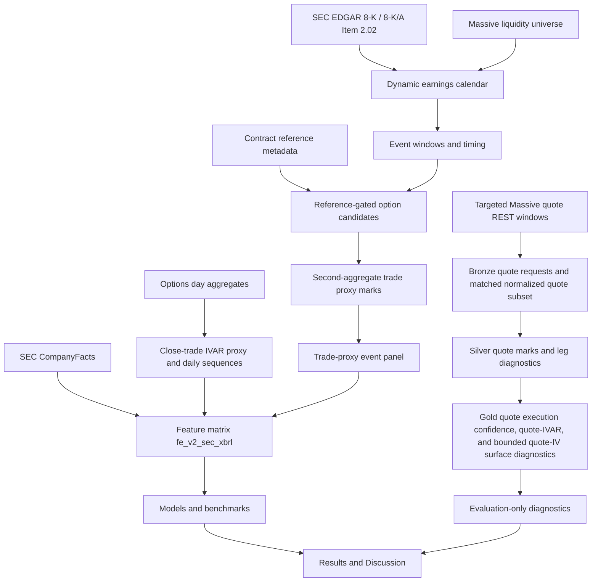

---
hide:
  - navigation
---

# Paper Plan

Working title:

**Can Machine Learning Improve Earnings Event-Variance Trading? Evidence from
U.S. Equity Options**

This page is the manuscript plan. It is written in paper order and keeps the
evidence boundary explicit: the current package is a complete proxy-stage
research run, not a paper-grade executable NBBO backtest.

## Abstract

This paper asks whether machine-learning models can improve trading decisions
around option-implied earnings event variance mispricing. The object is not
generic implied-volatility forecasting. Models forecast realized earnings-event
variance, the market benchmark is option-implied event variance `IVAR_event`,
and the economic question is whether predicted mispricing improves
premium-space trade selection after costs.

The verified cold-run sample uses a SEC-first earnings calendar and Massive
market-data proxy route for U.S. single-name equity options from 2016-10-01
through 2026-06-05. The current run produced a 2,388-row feature matrix,
targeted quote diagnostics for 2,329 quote-confidence events, 65,172
quote-window requests, 21,680,332 matched quote rows, 27 model-target
evaluations, 27 forecast rows, 27 ranking rows, 54 strategy rows, IVAR-defeat
artifacts, casebook artifacts, a source-coverage audit, and 11 report figures.

The main result is not a trading-alpha claim. The evidence supports a
conservative signal-screening contribution: a reproducible framework that
compares market IVAR, historical baselines, Goyal-Saretto-style RV-IV spread,
tabular ML, FT-Transformer, and sequence diagnostics under leakage controls and
quote-aware diagnostics. Paper-grade execution remains blocked by incomplete
full-window quote/NBBO-equivalent coverage and full-sample quote-IVAR/surface
evidence.

## 1. Introduction

### 1.1 Overview and Motivation

Earnings announcements create scheduled jumps in uncertainty. Short-dated
options embed the market's expectation of this event variance, but the
empirical question is whether pre-event information can improve the
cross-sectional ranking of expected event-variance mispricing.

The paper-facing question is:

> Can models improve trading decisions around option-implied earnings event
> variance mispricing?

The research object is:

```text
RVAR_event - IVAR_event
```

The tradable proxy layer is premium-space and cost-aware:

```text
expected_strategy_edge_usd
  = expected_strategy_value_usd - market_entry_cost_usd
```

Forecast accuracy is therefore supporting evidence, not the headline claim. A
useful model must improve ranking, tail selection, and premium-space economics
without overstating the execution route.

### 1.2 Literature Review and Existing Results

This paper sits at the intersection of scheduled-jump option pricing,
earnings-option return predictability, RV-IV spread signals, and empirical
asset-pricing ML.

| Literature stream | Existing result shape | Role in this paper |
| --- | --- | --- |
| Earnings option pricing and scheduled jumps | Short-dated options price a discrete earnings uncertainty component. | Motivates extracting event variance rather than forecasting total IV. |
| Earnings straddle-return studies | Average earnings option returns depend on implied uncertainty, realized moves, and costs. | Motivates event-level trade selection rather than only average straddle returns. |
| RV-IV spread and option-return predictability | Realized-minus-implied variance spreads can predict option returns in some settings. | Provides a required classical benchmark through a Goyal-Saretto-style spread. |
| Empirical asset pricing with ML | ML claims need out-of-sample ranking, economic value, and strong tabular baselines. | Requires validation-only tuning, locked test evaluation, and LightGBM/XGBoost comparisons. |
| Surface and sequence modeling | Ordered option-surface paths may contain incremental pre-event information. | Motivates FT-Transformer, ridge-flat sequence aggregates, attention/CNN sequence diagnostics, and mask/time-shuffle controls. |

### 1.3 Research Gap

The gap is not whether implied volatility can be forecast in general. The gap
is whether pre-event state, earnings history, fundamentals, liquidity, and
option-surface proxy features can sort earnings events by realized
event-variance mispricing in a way that survives transaction-cost-aware option
trade selection.

The main discipline gaps this paper addresses are:

- lower RMSE is not sufficient if ranking and net PnL do not improve;
- sequence-model value must be tested against tabular baselines and
  mask/time-shuffle controls;
- second-aggregate trade bars cannot be reported as executable bid/ask or NBBO
  results;
- C2O and O2C decompositions are scientific diagnostics unless the execution
  route supports a tradable claim.

### 1.4 Research Questions and Hypotheses

Primary research question:

- Do models improve the ranking of earnings event-variance mispricing relative
  to market-implied `IVAR_event` and simple historical baselines?

Secondary questions:

- Do state/history/fundamental/liquidity features improve ranking and
  economics relative to market IVAR and classical baselines?
- Do ordered pre-event proxy-surface sequences add incremental value beyond
  event-level tabular aggregates?
- Does ranking improvement translate into `day_c2c` premium-space proxy
  economics after costs?
- Are C2O jump forecasts and O2C post-open digestion forecasts scientifically
  useful even when they are not headline strategy evidence?

Expected hypotheses:

| Hypothesis | Evidence needed |
| --- | --- |
| Market IVAR is a strong level benchmark but not necessarily an optimal ranking signal. | OOS R2, AUC, top-decile precision, and edge-decile monotonicity versus IVAR. |
| State/history features can improve cross-sectional sorting under proxy execution. | Locked validation/test ranking, edge-decile monotonicity, and premium-space proxy economics. |
| Sequence models are diagnostic unless they beat tabular baselines and controls. | Common-row sequence diagnostics, mask/time-shuffle comparisons, and economics gates. |
| Trade value requires premium-space selection, not raw variance-edge ranking alone. | Net proxy PnL, cost sensitivity, drawdown, turnover, and quote-confidence stratification. |

### 1.5 Contribution

The intended contribution is empirical and protocol-driven:

> A leakage-controlled event-variance mispricing framework shows where models
> improve forecast/ranking diagnostics relative to market IVAR and classical
> baselines, while preserving a clear boundary between proxy signal screening
> and paper-grade execution.

Contributions:

- a SEC-first earnings-event calendar and dynamic liquid single-name option
  universe;
- target construction separating `jump_c2o`, `day_c2c`, and `reaction_o2c`;
- a market IVAR benchmark and Goyal-Saretto-style RV-IV spread comparator;
- a benchmark ladder spanning market IVAR, historical baselines, Elastic Net,
  LightGBM, XGBoost, ensemble, FT-Transformer, and sequence diagnostics;
- a premium-space proxy strategy layer;
- quote-aware execution confidence, IVAR-defeat analysis, and false-positive /
  false-negative casebook artifacts;
- a completion-gap audit that prevents proxy evidence from being upgraded into
  paper-grade NBBO claims.

## 2. Materials and Methods

### 2.1 Data Sources and Market Description

| Source | Use |
| --- | --- |
| SEC EDGAR 8-K / 8-K/A Item 2.02 filings | Earnings-event discovery and primary-document validation. |
| SEC company ticker metadata | Common-equity-like single-name eligibility and CIK mapping. |
| SEC CompanyFacts | Public XBRL fundamentals with point-in-time gating. |
| Massive options day aggregates | Universe liquidity ranking, contract discovery, close-trade-implied IV proxies, and daily sequences. |
| Massive option contract reference metadata | Multiplier and deliverable diagnostics. |
| Massive option second aggregates | Entry/exit trade-price proxy marks. |
| Massive targeted quote REST windows | Quote-aware event-window diagnostics, leg marks, quote-IVAR diagnostics, confidence bands, and bounded quote-IV surface diagnostics. |

Current option second aggregates are trade OHLCV bars. They are not quotes,
bid/ask, OPRA, or NBBO data. The quote route uses targeted event windows and
does not store full-day raw quote files.

### 2.2 Sample, Universe, and Event Timing

Verified cold-run target window:

```text
2016-10-01 through 2026-06-05
```

Current verified artifacts:

| Artifact | Value |
| --- | ---: |
| Feature matrix rows | 2,388 |
| Feature-schema rows | 569 |
| Model features | 407 |
| Event-level model features | 249 |
| Tree model features | 407 |
| Quote-confidence events | 2,329 |
| Quote-window requests | 65,172 |
| Matched quote rows | 21,680,332 |
| Event windows without quote confidence | 60 |
| Targeted request events with zero returned quote rows | 923 |

The lake-quality audit remains a negative gate:

| Item | Value |
| --- | ---: |
| Required datasets | 15 |
| Incomplete required datasets | 13 |
| Paper-grade execution ready | `false` |

The source coverage audit closes the offset-gap question but does not close
paper-grade source coverage. It shows 60 event windows have no
quote-confidence row because 22 have no contract candidates and 38 have no
quote-eligible contracts. It also shows 923 targeted-request events returned
zero quote rows. This supports bounded REST-window diagnostics, not a proof of
full historical NBBO unavailability.

### 2.3 Target Construction

| Target | Definition | Role |
| --- | --- | --- |
| `day_c2c` | Close-to-close realized earnings-event variance. | Current proxy-PnL headline and canonical tuning target. |
| `jump_c2o` | Close-to-open earnings jump variance. | Primary scientific decomposition target. |
| `reaction_o2c` | Open-to-close reaction variance. | Post-open digestion diagnostic. |

Learned tabular models and FT-Transformer use the canonical log target:

```text
log(max(RVAR, 0) + 1e-6)
```

Predictions are back-transformed to raw variance units before evaluation and
strategy logic.

### 2.4 IVAR Construction

`IVAR_event` is the market-implied event-variance benchmark. Current canonical
economics still rely on no-NBBO trade-proxy inputs; quote-derived IVAR and
bounded quote-IV surface outputs are diagnostic until full historical
NBBO-equivalent coverage is proven.

### 2.5 Preprocessing, Pretreatment, and Leakage Control

The pipeline enforces:

- event-level chronological split;
- train-only normalization for model features;
- locked test evaluation;
- point-in-time SEC CompanyFacts gating;
- exclusion of raw identifiers, post-event labels, outcome/PnL fields, quote
  execution confidence fields, quote-IVAR fields, and unsupported NBBO claims
  from model features;
- feature-schema allowlist through `feature_schema_report.csv`.

### 2.6 Data Pipeline



### 2.7 Feature Engineering

Feature families:

- market IVAR and RV-IV spread features;
- prior realized variance and earnings-history features;
- option-surface proxy levels, slopes, skew, butterfly, liquidity, and run-up
  features;
- sequence aggregate features;
- SEC CompanyFacts fundamentals and SIC controls;
- liquidity and execution-cost proxies;
- missingness and data-quality controls.

Execution confidence, quote-IVAR, quote-IV surface, realized outcomes, and PnL
fields are evaluation/casebook fields, not model features.

### 2.8 Models

| Family | Models | Purpose |
| --- | --- | --- |
| Market benchmark | `market_implied_event_variance` | Required IVAR comparator. |
| Historical baselines | `last_four_rvar`, `last_four_ivar` | Simple repeat-event memory. |
| Classical spread benchmark | `goyal_saretto_rv_iv_spread` | Goyal-Saretto-inspired event RV-IV spread comparator. |
| Regularized linear | `linear_elastic_net_tuned` | Sparse/regularized tabular baseline. |
| Tree models | `lightgbm_tuned`, `xgboost_tuned` | Main tabular ML benchmarks. |
| Ensemble | `lightgbm_xgboost_forecast_ensemble` | Variance forecast average plus rank-score ordering. |
| Tabular deep | `ft_transformer` | Deep tabular benchmark. |
| Sequence tensor diagnostics | sequence coverage, hybrid tensor v2 quality, retired-model manifest | Builds ordered pre-event proxy-surface tensors and quality checks. |
| Deferred sequence model suite | ridge-flat, attention, dilated CNN, mask-only, and time-shuffle rows | Not active in the current metric snapshot because this verified refresh used `sequence_suite=none`. |

Slow recurrent/SSM 5-seed sequence ensembles are retired.

### 2.9 Performance Metrics and Selection Criteria

| Metric family | Metrics | Reason |
| --- | --- | --- |
| Forecast fit | MAE, RMSE, QLIKE, OOS R2 versus IVAR | Measures variance-level accuracy and market-benchmark improvement. |
| Ranking | AUC, top-decile precision, Brier, edge-decile Spearman | Measures whether the model sorts mispricing. |
| Strategy proxy | Gross/net PnL, return on premium/capital, Sharpe, Sortino, drawdown, hit rate, turnover | Measures premium-space trade selection after proxy costs. |
| Robustness | DTE, liquidity, regime, timing, ticker/year, quote-confidence breakdowns | Tests whether results are broad or small-cell. |
| Diagnostics | IVAR defeat, casebook, quote confidence, quote-IVAR availability | Explains when models beat or fail against market IVAR. |

Selection uses validation-only tuning. The locked test is used once for final
evaluation. The current canonical profile is
`tuned_phase1_day_c2c_rank_log_rvar`.

### 2.10 Strategy Layer

Strategy rows are proxy-stage only. `day_c2c` is the current headline proxy
economics target. `jump_c2o` and `reaction_o2c` strategy rows are diagnostic
unless the execution route can support a tradable option-price path.

The LightGBM/XGBoost ensemble has dual output:

- raw variance forecast average for expected-edge magnitude;
- split-level percentile rank score over predicted base edges for ranking,
  edge deciles, and top-k ordering.

## 3. Expected Experiments

### 3.1 Completed Proxy-Stage Experiments

| Experiment | Artifact evidence |
| --- | --- |
| Main cold-run data/features/models/report | External cold-run root under `/home/tycheng/data/earnings-event-vol`. |
| Benchmark ladder | `forecast_metrics.csv`, `ranking_metrics.csv`, `strategy_metrics.csv`. |
| Quote-aware execution confidence | Quote execution gold artifacts and quote-confidence summary CSVs. |
| IVAR defeat analysis | `ivar_defeat_events.csv`, `ivar_defeat_metrics.csv`, `ivar_defeat_breakdowns.csv`. |
| Casebook | `casebook_events.csv`, `casebook_summary.csv`, quote-confidence casebook summary. |
| Source coverage audit | `quote_source_coverage_audit/*`, classifying no-candidate, no-quote-eligible, and targeted-no-row cases. |
| Report figures | 11 figures under external `reports/modeling/figures` and synced docs assets. |

### 3.2 Required Paper-Grade Experiments

| Required experiment | Current status |
| --- | --- |
| Full-window quote/NBBO or equivalent coverage | Not proven; lake audit and source coverage audit block paper-grade execution. |
| Full-sample quote-IVAR and quote-IV surface | Diagnostic artifacts exist, but completion-gap audit still blocks full paper-grade claim. |
| Paper-grade bid/ask/NBBO crossing | Not complete. |
| Sequence full-suite model rows | Not populated in the current verified refresh; sequence tensors are diagnostics only. |
| Final robustness with fewer small cells | Pending paper-grade data coverage. |

### 3.3 Decision Rules

| Outcome | Manuscript claim |
| --- | --- |
| ML improves forecast/ranking but not economics | Signal-screening contribution with market-efficiency/execution limitations. |
| Classical spread dominates ML | Hard-to-beat benchmark result. |
| Positive proxy economics remain small-trade | Exploratory economics only, not headline alpha. |
| Results survive full quote/NBBO route | Candidate paper-grade trading evidence. |
| Proxy signal disappears under quote execution | Report realistic execution limits and keep model evidence diagnostic. |

## 4. Planned Results and Discussion Structure

`results_snapshot.md` should follow this order:

1. execution grade and reproducibility;
2. research question and evidence map;
3. sample construction and lake-quality coverage;
4. model suite;
5. forecast and ranking results;
6. headline `day_c2c` strategy results;
7. `jump_c2o` and `reaction_o2c` decomposition diagnostics;
8. feature-schema hygiene;
9. cost sensitivity and robustness;
10. calibration and QLIKE;
11. sequence diagnostic gate;
12. quote-aware diagnostics, IVAR defeat, and casebook;
13. current sellable claim and claim boundaries.

## 5. Limitations

| Limitation | Implication |
| --- | --- |
| Evidence grade is `no_nbbo_trade_proxy`. | Current results are signal-screening, not executable trading. |
| Lake-quality audit is `ok=false`. | Full target-window paper-grade coverage is not established. |
| Quote diagnostics are targeted windows, not full raw quote lake. | Useful for confidence stratification, not full OPRA/NBBO claim. |
| Positive strategy rows have very small trade counts. | Do not sell economic outperformance. |
| Sequence model suite was not populated in the verified refresh. | Keep sequence claims diagnostic until a deliberate sequence-suite run is completed. |

## 6. Conclusion

The current package is strong enough for an internal working-paper draft about
event-variance mispricing signal screening and benchmark discipline. It is not
yet strong enough for a paper-grade executable trading claim. The next
scientific decision is whether to stop at conservative proxy evidence or invest
in full-window quote/NBBO-equivalent coverage.

## Appendix Plan

| Appendix | Content |
| --- | --- |
| A | Literature and positioning. |
| B | Data pipeline and leakage controls. |
| C | Feature schema and excluded columns. |
| D | Hyperparameter profile and selected parameters. |
| E | Quote-confidence diagnostics. |
| F | IVAR defeat and casebook examples. |
| G | Robustness and small-cell warnings. |
