---
hide:
  - navigation
---

# Paper Plan

Working title:

**Can Deep Learning Improve Earnings Volatility Trading? Evidence from U.S. Equity Options**

Technical title:

**State-Selective Event Variance Forecasting for Earnings Options: A Mamba-Based Approach with Risk-Defined Backtests**

This document is organized as a paper-facing experimental design. It is not a
generic implied-volatility forecasting plan. The central object is whether
models improve tradable decisions around option-implied earnings event variance
mispricing.

## 1. Introduction

### 1.1 Core Question

The paper asks:

> Can machine-learning models improve the cross-sectional ranking of
> option-implied earnings event variance mispricing, and does that improvement
> survive realistic proxy transaction costs?

The forecast target is realized event variance:

```text
RVAR_event = log(S_after / S_before)^2
```

The market baseline is option-implied event variance:

```text
IVAR_event
```

The ex post mispricing label is:

```text
RVAR_event - IVAR_event
```

The strategy layer is evaluated in premium space:

```text
expected_strategy_edge_usd
  = expected_strategy_value_usd - market_entry_cost_usd
```

The first entry rule is:

```text
expected_strategy_edge_usd > 1.5 * estimated_transaction_cost_usd
```

Forecast error is therefore supportive evidence. The paper-facing result is
whether a model improves ranking, edge selection, and net proxy performance in
the tradable tail.

### 1.2 Contribution

The contribution is not "Mamba predicts IV better." The intended contribution is:

> State-dependent pre-earnings option-surface dynamics may contain incremental
> information about event variance mispricing beyond market-implied event
> variance, historical earnings moves, and GBDT tabular baselines.

The interpretation is outcome-dependent:

- If Mamba wins, pre-event sequence dynamics matter.
- If LightGBM wins, event-level nonlinear tabular interactions are enough.
- If IVAR wins after costs, the evidence is consistent with a hard-to-beat
  earnings option market under realistic frictions.
- If gains appear only in thin liquidity buckets, the result is not yet
  paper-grade execution evidence.

### 1.3 Literature Review and Positioning

The paper sits at the intersection of earnings-announcement option pricing,
event-volatility trading, option-return predictability, and modern model
comparison.

**Earnings option and event-volatility literature**

| Study | Object | Main implication for this paper |
| --- | --- | --- |
| [Patell & Wolfson (1981)](https://ideas.repec.org/a/bla/joares/v19y1981i2p434-458.html) | Earnings announcements in option and stock prices. | Establishes the pre/post-announcement uncertainty pattern. |
| [Dubinsky, Johannes, Kaeck & Seeger (2019)](https://research.vu.nl/en/publications/option-pricing-of-earnings-announcement-risks/) | Option pricing with scheduled earnings jumps. | Supports extracting event variance separately instead of using `IV^2 * T`. |
| [Barth & So (2014)](https://www.gsb.stanford.edu/faculty-research/publications/non-diversifiable-volatility-risk-risk-premiums-earnings) | Implied versus realized announcement volatility. | Closest risk-premium object: `IVAR_event - RVAR_event`. |
| [Donders, Kouwenberg & Vorst (2000)](https://ideas.repec.org/a/bla/eufman/v6y2000i2p149-171.html) | Volume, open interest, and liquidity around earnings. | Motivates liquidity filters and cost sensitivity. |
| [Gao, Xing & Zhang (2018)](https://www.cambridge.org/core/journals/journal-of-financial-and-quantitative-analysis/article/abs/anticipating-uncertainty-straddles-around-earnings-announcements/7B34877AD5E06304BA3C55FBA3219FDD) | ATM straddle returns around earnings. | Directly supports testing earnings volatility trades, with liquidity caveats. |
| [Chung & Louis (2017)](https://pure.psu.edu/en/publications/earnings-announcements-and-option-returns/) | Before- and after-earnings straddle returns. | Supports the before-event long-volatility test and transaction-cost reporting. |
| [Alexiou, Goyal, Kostakis & Rompolis (2025)](https://revfin.org/pricing-event-risk-evidence-from-concave-implied-volatility-curves/) | Concave short-term IV curves around event risk. | Supports butterfly/concavity as an incremental event-risk feature. |
| [Goyal & Saretto (2009)](https://doi.org/10.1016/j.jfineco.2009.01.001) | Cross-section of option returns and RV-IV spreads. | Provides a required classical option-mispricing benchmark. |
| [Chen, Gan & Vasquez (2023)](https://www.sciencedirect.com/science/article/pii/S0378426622003351) | Straddle decomposition into volatility and jump components. | Closely related to the event-jump component, but not an ML ranking test. |

**ML, surface, and sequence-modeling literature**

| Study | Object | Main implication for this paper |
| --- | --- | --- |
| [Hutchinson, Lo & Poggio (1994)](https://web.mit.edu/Alo/www/Papers/hutchinson-etal-94.html) | Neural networks for derivative pricing and hedging. | Early precedent for ML in option pricing, not an event-mispricing test. |
| [Horvath, Muguruza & Tomas (2021)](https://portal.fis.tum.de/en/publications/deep-learning-volatility-a-deep-neural-network-perspective-on-pri/) | Deep-learning volatility surfaces for pricing/calibration. | Supports structured surface inputs, but the objective differs. |
| [Gu, Kelly & Xiu (2020)](https://academic.oup.com/rfs/article/33/5/2223/5758276) | Empirical asset pricing with ML. | Sets the evaluation discipline: out-of-sample and economic value. |
| [Borochin & Zhao (2025)](https://ideas.repec.org/a/eee/empfin/v82y2025ics0927539825000404.html) | Economic value of equity IV forecasting with ML. | Closest ML/economic-value comparator, but not earnings-event variance. |
| [Hoefler (2024)](https://papers.ssrn.com/sol3/papers.cfm?abstract_id=4869272) | Volatility surfaces and expected option returns. | Supports the idea that surface shape can forecast option returns. |
| [Gorishniy et al. (2021)](https://proceedings.neurips.cc/paper/2021/hash/9d86d83f925f2149e9edb0ac3b49229c-Abstract.html) | Deep learning for tabular data. | Justifies FT-Transformer and requires GBDT comparisons. |
| [Gu & Dao (2024)](https://openreview.net/forum?id=AL1fq05o7H) | Mamba selective state-space sequence model. | Provides architecture rationale for pre-earnings path encoding. |

The positioning statement is:

> Unlike prior work that documents average earnings straddle returns or
> estimates announcement risk premia, this paper tests whether models improve
> the cross-sectional ranking of option-implied event variance mispricing in the
> tradable tail after costs.

See Appendix A for the full citation table and Appendix B for the protocol
mapping from each paper to implementation choices.

## 2. Materials and Methods

### 2.0 Full Pipeline Map

This diagram is the paper workflow in one place. It separates official event
data from vendor market data, shows which data frequency is used where, and
keeps the proxy execution caveat visible.

```mermaid
flowchart TB
  %% Inputs
  subgraph raw["Raw inputs"]
    sec["SEC EDGAR filings\n8-K / 8-K/A Item 2.02\nacceptance timestamp\nprimary filing document text"]
    sec_meta["SEC company ticker metadata\ncommon-equity eligibility\nexclude ETF / index / fund / trust"]
    opt_day["Massive options day aggregates\ndaily trade OHLCV by option contract"]
    stock_day["Massive underlying day aggregates\ndaily OHLCV by stock"]
    opt_ref["Massive option reference\n/v3/reference/options/contracts\nshares_per_contract\nadditional_underlyings\nexercise_style\ncorrection"]
    opt_sec["Massive option second aggregates\nrange/1/second\ntrade OHLCV bars\nnot quote, not bid/ask, not NBBO"]
    index_sec["Optional SPY / QQQ second aggregates\noptions and underlying\nentry-as-of market controls"]
    fred["FRED VIXCLS\ndaily VIX close\nprior-close aligned"]
  end

  %% Universe and event calendar
  subgraph universe_calendar["Universe and earnings calendar"]
    equity_filter["Eligible single-name universe filter\nNYSE / NASDAQ common-equity-like tickers\nremove SPY, QQQ, IWM, VIX, GLD, SPX, SPXW"]
    liquidity["Monthly liquidity table\noption_premium_dollar_volume\n= option price * volume * 100\nVWAP if available, close fallback"]
    top50["Dynamic monthly top 50\ntrailing six-month option premium dollar volume\ncurrent month excluded"]
    sec_calendar["SEC-first event calendar\ncandidate discovery from Item 2.02\nvalidation from SEC primary document text\nMassive text only auxiliary"]
    event_filter["Main event filters\nBMO / AMC only\nDMH and unknown timing excluded\nlatest prior universe month membership"]
  end

  sec_meta --> equity_filter
  opt_day --> liquidity
  equity_filter --> top50
  liquidity --> top50
  top50 --> sec_calendar
  sec --> sec_calendar
  sec_calendar --> event_filter

  %% Event alignment
  subgraph alignment["Event timing and target construction"]
    bmo["BMO event on date d\nentry uses close d-1\nS_before = close d-1\nS_after = close d"]
    amc["AMC event on date d\nentry uses close d\nS_before = close d\nS_after = close d+1"]
    entry_cutoff["event_entry_timestamp\nresolved market close\nhandles early close days"]
    rvar["Forecast target\nRVAR_event = log(S_after / S_before)^2"]
    leak_gate["Leakage gate\nfeature_asof_timestamp <= event_entry_timestamp\nno exit date or post-event bars"]
  end

  event_filter --> bmo
  event_filter --> amc
  stock_day --> bmo
  stock_day --> amc
  bmo --> entry_cutoff
  amc --> entry_cutoff
  bmo --> rvar
  amc --> rvar
  entry_cutoff --> leak_gate

  %% Contract and IV construction
  subgraph contract_iv["Contracts, IVAR, and proxy entry prices"]
    contract_discovery["Candidate option contracts\nDTE discovery 3-21\nmain flag 5-14\nmust cover event window"]
    ref_validation["Contract reference validation\noverride multiplier / contract_size / deliverable_status\nnon-100 or adjusted deliverable -> non_standard_excluded\nfetch failure -> manifest diagnostic"]
    iv_proxy["Daily local IV proxy\nfrom options day-agg close trade price\nclose_trade_implied\nnot NBBO-mid IV"]
    ivar["Market baseline\nIVAR_event from two adjacent event-covering expiries\nfailure reasons: missing expiries, negative IVAR, nonmonotone variance"]
    second_buffer["Entry proxy bars\noption second aggregates only before cutoff\ndefault buffer: 60 minutes before cutoff\nentry lookback: final 900 seconds"]
    entry_price["Entry price proxy\nlatest positive option_vwap\noption_close fallback\ntrade-price proxy only"]
    exit_price["Exit mark\nsame-contract options day-agg close\nintrinsic fallback only if exit close missing or 0DTE"]
  end

  event_filter --> contract_discovery
  opt_day --> contract_discovery
  opt_ref --> ref_validation
  contract_discovery --> ref_validation
  ref_validation --> iv_proxy
  opt_day --> iv_proxy
  iv_proxy --> ivar
  ref_validation --> second_buffer
  opt_sec --> second_buffer
  entry_cutoff --> second_buffer
  second_buffer --> entry_price
  ref_validation --> exit_price
  opt_day --> exit_price
  rvar --> ivar

  %% Feature engineering
  subgraph features["Feature engineering"]
    event_features["Event-level feature matrix\nIVAR_event\nATM IV / term spread / skew / butterfly\noption activity\nRV5 / RV20 / RV60\nlast-four earnings history\nBMO/AMC flag\nuniverse rank and liquidity bucket"]
    daily_sequence["20-day daily sequence\nseq_t00 oldest allowed day\nseq_t19 latest allowed day\nsingle-name daily option-surface summaries\nunderlying return and RV5\nVIX daily state\nSPY / QQQ daily controls if available"]
    market_second["Optional entry-as-of market controls\nSPY / QQQ ATM IV proxy\nterm slope\nskew / butterfly\nstraddle premium / spot\noption volume / transactions\nunderlying pre-cutoff return"]
    vix_features["VIX features\nresolved_vix_date before feature_asof_date\nvix_level, 1d change, 5d change\n252d percentile, tercile regime, above 30 flag"]
  end

  ivar --> event_features
  rvar --> event_features
  stock_day --> event_features
  ref_validation --> event_features
  opt_day --> daily_sequence
  stock_day --> daily_sequence
  fred --> vix_features
  vix_features --> event_features
  vix_features --> daily_sequence
  index_sec --> market_second
  entry_cutoff --> market_second
  market_second --> event_features

  %% Splits and model inputs
  subgraph splits_models["Splits and models"]
    split_now["Current proxy split\nchronological event-level 70 / 15 / 15\nsplit unit = event_id\nno random split\nsame event never crosses splits"]
    split_later["Final paper robustness when longer data exists\nrolling walk-forward\ntrain 5y, validate 1y, test 1y\npurge same-ticker adjacent leakage"]
    baseline_models["Deterministic baselines\nIVAR market baseline\nlast-four RVAR\nlast-four IVAR\nGoyal-Saretto RV-IV spread\nPatell-Wolfson diagnostics"]
    tabular_models["Tabular models\nElastic Net\nLightGBM\nXGBoost optional\nFT-Transformer V1"]
    mamba_models["Sequence models\nproxy-Mamba on ordered 20-day tensor\nmask-only Mamba ablation\nuses close-trade-implied proxy surface, not NBBO-mid surface"]
  end

  event_features --> split_now
  daily_sequence --> split_now
  split_now --> baseline_models
  split_now --> tabular_models
  split_now --> mamba_models
  split_now -. future paper check .-> split_later

  %% Forecast to trade decision
  subgraph backtest["Backtest logic and strategy assumptions"]
    forecasts["Model output\nforecast_RVAR_event\npositive floor = 1e-6"]
    var_edge["Variance edge\nforecast_RVAR_event - IVAR_event\nused for ranking and diagnostics"]
    premium_edge["Premium-space edge\nexpected_strategy_value_usd - market_entry_cost_usd\nthis drives trade selection"]
    long_straddle["Long ATM straddle\nused when event vol is predicted cheap"]
    short_iron_fly["Short iron fly\nused when event vol is predicted rich\nrisk-defined short-vol proxy"]
    cost_model["Proxy cost model\nproxy_cost_usd = 0.005 * entry_premium_usd\ncost multipliers: 0, 0.5, 1, 1.5, 2, 3, 5\nmultiplier 0 is diagnostic only"]
    pnl["Proxy PnL\nentry from second bars\nexit from option day close\npaper_grade = false\npanel_grade = no_nbbo_trade_proxy"]
  end

  baseline_models --> forecasts
  tabular_models --> forecasts
  mamba_models --> forecasts
  forecasts --> var_edge
  ivar --> var_edge
  forecasts --> premium_edge
  entry_price --> premium_edge
  premium_edge --> long_straddle
  premium_edge --> short_iron_fly
  cost_model --> premium_edge
  long_straddle --> pnl
  short_iron_fly --> pnl
  entry_price --> pnl
  exit_price --> pnl

  %% Evaluation
  subgraph evaluation["Evaluation outputs"]
    forecast_metrics["Forecast metrics\nMAE\nRMSE\nQLIKE\nOOS R2 vs IVAR"]
    ranking_metrics["Ranking and mispricing metrics\ntop-decile precision\nAUC and Brier for direction\ncalibration\nedge-decile monotonicity"]
    strategy_metrics["Strategy metrics\ngross and net proxy PnL\nreturn on premium / capital\nSharpe / Sortino\nmax drawdown\nhit rate\naverage win / loss\ncost sensitivity"]
    robustness["Breakdowns and inference\nDTE 5-14 vs 3-21\nBMO vs AMC\nliquidity buckets\nticker, year, regime\npaired loss differential\nclustered SE\nblock bootstrap"]
    outputs["Paper outputs\ntables\nfigures\nproxy_research_report.md\nResults Snapshot"]
  end

  forecasts --> forecast_metrics
  var_edge --> ranking_metrics
  pnl --> strategy_metrics
  forecast_metrics --> outputs
  ranking_metrics --> outputs
  strategy_metrics --> outputs
  robustness --> outputs
  split_now --> robustness
  vix_features --> robustness
```



### 2.1 Data Sources

The current proxy route uses official sources for event discovery and vendor
market data for prices:

- **SEC EDGAR** is the primary earnings-event source. The pipeline discovers
  8-K / 8-K/A Item 2.02 candidates, uses SEC acceptance timestamps as an
  auditable timing proxy, and validates filing text from SEC primary documents.
- **Massive 8-K text** is auxiliary only. It can help when SEC document text is
  unavailable or inconclusive, but it is not required for the calendar chain.
- **Massive options day aggregates** support universe liquidity ranking,
  contract discovery, local IV proxy inputs, same-contract exit option close,
  and 20-day close-trade-implied option-surface sequences.
- **Massive option contract reference metadata** validates selected candidate
  contracts before entry-price fetching. The pipeline reads
  `shares_per_contract`, `additional_underlyings`, `exercise_style`, and
  `correction` from `/v3/reference/options/contracts`; non-100 or adjusted
  deliverables are excluded from proxy trading rows.
- **Massive underlying day aggregates** support underlying closes, event returns,
  `RVAR_event`, exit spot, and daily market-return controls.
- **Massive option one-second aggregates** support targeted pre-cutoff entry
  proxy prices and optional SPY/QQQ market-state controls.
- **FRED VIXCLS** supplies daily VIX state and regime controls.

All trade-proxy market outputs are labeled `no_nbbo_trade_proxy`. They are trade
OHLCV aggregates, not quote, bid/ask, or NBBO records. Full paper-grade
execution claims require a later quote/NBBO route.

### 2.2 Study Sample and Universe

Target paper sample:

- U.S. single-name option underlyings.
- Dynamic monthly top 50 by trailing six-month option premium dollar volume.
- 2013-2025 target range.
- BMO and AMC earnings only.
- Main event-expiry DTE: 5-14.
- Robustness DTE: 3-21.
- DMH and unknown timing excluded.

Runnable current proxy sample:

- The observed Massive option day-agg entitlement in this workspace begins on
  2022-05-04.
- The active default therefore runs 2022-12-01 through 2025-12-31, using the
  six-month lookback needed for the December 2022 universe.
- The 2013-2025 paper target requires upgraded historical options entitlement
  or another licensed historical options data route.

Universe construction:

```text
option_premium_dollar_volume = option_price * contract_volume * 100
```

`option_price` uses VWAP when available and close as fallback. The universe
filter first removes ETF, index, volatility, commodity trust, ETN, fund, and
other non-single-name-like symbols using SEC company ticker metadata. SPY, QQQ,
IWM, VIX, GLD, SPX, and SPXW cannot consume single-name universe slots, though
SPY/QQQ may be used later as market controls.

Appendix C will report universe membership, turnover, excluded tickers, and
monthly liquidity distributions.

### 2.3 Event Alignment and Preprocessing

Timestamp alignment is a hard gate. Every feature row must satisfy:

```text
feature_asof_timestamp <= event_entry_timestamp
```

AMC events:

- Entry is before regular-session close on announcement date `d`.
- `S_before = close_d`.
- `S_after = close_{d+1}`.
- Event move is `log(close_{d+1} / close_d)`.

BMO events:

- Entry is before regular-session close on `d-1`.
- `S_before = close_{d-1}`.
- `S_after = close_d`.
- Event move is `log(close_d / close_{d-1})`.

SEC acceptance time is regulatory metadata, not necessarily the company's first
public release timestamp. Ambiguous events stay outside the main sample.

Mechanical filters:

```text
S_t > 5
positive option price
paired call/put availability
option_multiplier == 100
contract_size == 100
deliverable_status == standard
main sample: 5 <= event_expiry_DTE <= 14
robustness: 3 <= event_expiry_DTE <= 21
```

The `contract-reference-validation` stage runs after candidate discovery and
before second-aggregate entry fetching. When reference metadata is available it
overrides the day-agg placeholder multiplier and deliverable fields. Fetch
failures are written to the manifest as diagnostics; they do not promote any
contract to paper-grade status and do not change the `no_nbbo_trade_proxy`
limitation.

Appendix D will tabulate exclusions by reason, ticker, year, VIX regime, and
BMO/AMC timing.

### 2.4 Target and Market Baseline Construction

The forecast target is:

```text
RVAR_event = log(S_after / S_before)^2
```

The implied event variance baseline uses total ATM implied variance:

```text
w(T) = sigma_ATM(T)^2 * T
```

For two expiries that both cover the earnings event:

```text
w1 = d*T1 + v_e
w2 = d*T2 + v_e
IVAR_event = (T2*w1 - T1*w2) / (T2 - T1)
```

`T_j` follows the IV source's year-fraction convention. The proxy route uses
ACT/365 unless vendor documentation requires otherwise. Negative or nonmonotone
event-variance extraction is excluded from tradable samples and reported as an
extraction failure.

ATM selection:

- Prefer ATMF when a liquid near-ATM call/put pair supports a put-call-parity
  implied forward.
- Treat parity forward as an approximation for short-DTE U.S. single-name
  American options.
- Fall back to nearest-spot ATM when parity is weak, dividend-contaminated, or
  unavailable.

Appendix E will list IVAR failures with selected expiries, DTEs, IVs, total
variances, and failure reasons.

### 2.5 Feature Engineering

Event-level features:

- `IVAR_event`.
- ATM IV for event and adjacent expiries.
- Term spread.
- Skew and butterfly/concavity proxies.
- Option volume and transaction activity.
- RV5/RV20/RV60.
- Prior earnings move and last-four earnings statistics.
- BMO/AMC timing.
- Liquidity bucket and universe rank.
- Daily VIX state and VIX regime.
- Optional SPY/QQQ second-level entry controls.

VIX features:

- Source: public FRED `VIXCLS` graph CSV.
- Bronze raw: `data/bronze/market_covariates/fred_vixcls.csv`.
- Silver normalized:
  `data/silver/market_covariates/daily_market_covariates.parquet`.
- Headline alignment: `vix_alignment = prior_close_default`.
- Both BMO and AMC require `vix_date < feature_asof_date`.
- `max_vix_lag_days = 5`.

VIX changes use valid-observation lags:

```text
vix_change_1d = VIX(resolved_vix_date) - VIX(previous valid VIX date)
vix_change_5d = VIX(resolved_vix_date) - VIX(5th previous valid VIX observation)
```

Rolling VIX percentile/regime uses only observations with
`vix_date < resolved_vix_date`. The fixed flag `vix_above_30` uses the resolved
VIX level directly.

Sequence features:

- The Mamba path is daily-frequency, not second-frequency.
- Each event has up to 20 pre-entry trading-day timesteps.
- `seq_t00` is the oldest allowed day.
- `seq_t19` is the latest allowed day.
- Daily states include single-name close-trade-implied option-surface summaries,
  underlying RV/return, SPY/QQQ daily returns, SPY/QQQ daily surface summaries
  when available, and daily VIX features.

Second-level market controls:

- `market-second-covariates` optionally fetches SPY/QQQ option one-second
  aggregates and SPY/QQQ underlying one-second aggregates at event entry.
- Features include SPY/QQQ ATM IV proxy, term slope, skew, butterfly, straddle
  premium over spot, option volume/transaction count, and underlying pre-cutoff
  return.
- These are event-entry covariates, not a second-level Mamba sequence.

Appendix F will define the feature schema and source/as-of timestamp for every
column family.

### 2.6 Models

Financial and deterministic baselines:

1. Market-implied baseline: `forecast_RVAR_event = IVAR_event`.
2. Last-four RVAR baseline.
3. Last-four IVAR baseline.
4. Goyal-Saretto-style RV-IV spread baseline.
5. Patell-Wolfson-style diagnostics.

Trainable tabular models:

1. Linear / Elastic Net.
2. LightGBM.
3. XGBoost when dependency is available.
4. FT-Transformer.

Sequence model:

1. proxy-Mamba sequence encoder.
2. mask-only Mamba ablation.

Model input policy:

| Model | Event-level features | Sequence aggregates | Ordered sequence tensor | Mask |
| --- | --- | --- | --- | --- |
| IVAR baseline | IVAR only | No | No | No |
| Last-four baselines | Prior events only | No | No | No |
| Elastic Net | Yes | No | No | No |
| LightGBM/XGBoost | Yes | Mean/last/slope/std aggregates | No | No |
| FT-Transformer | Yes | No | No | No |
| proxy-Mamba | Optional late fusion | No | Yes | Yes |
| mask-only Mamba | No values | No | Zeroed tensor | Yes |

### 2.7 Loss Functions and Forecast Postprocessing

Mamba uses q=0.5 quantile loss on log-transformed realized event variance:

```text
log_target = log(RVAR_event + forecast_floor)
forecast_floor = 1e-6
```

Predictions are transformed back to variance space before all economic metrics:

```text
forecast_rvar = max(exp(log_forecast) - forecast_floor, forecast_floor)
```

The q=0.5 loss optimizes median/MAE-style behavior. RMSE and QLIKE are reported
as comparison metrics, not optimized objectives.

### 2.8 Splits, Resampling, and Inference

No random split is used. The proxy-stage default is chronological event-level
holdout:

```text
train:      first 70% of events by event_entry_timestamp
validation: next 15%
test:       last 15%
```

The split unit is `event_id`; all rows for the same event remain in the same
split. The final paper design should move to rolling walk-forward:

- Train five years.
- Validate one year.
- Test the next year.
- Purge adjacent same-ticker earnings leakage.
- Keep same-date peer-firm events out of random splits.

Inference layer:

- Paired loss differential versus IVAR baseline.
- Event-date clustered standard errors.
- Ticker clustered standard errors.
- Two-way clustered standard errors where feasible.
- Event-month block bootstrap confidence intervals.
- SPA or model-confidence-set tests only if many models/thresholds are compared.

If clusters are insufficient, the result is reported as
`status=insufficient_clusters`, not silently dropped.

### 2.9 Backtest Setup

Primary strategies:

1. Long ATM straddle for predicted cheap event volatility.
2. Short iron fly for predicted rich event volatility.

Calendar straddles are deferred. They mix event variance, post-event vega, theta,
front/back gamma mismatch, skew, dividends, borrow, and assignment risk.

Premium-space valuation:

- Use deterministic quadrature under a zero-mean Gaussian event-return
  distribution with variance `forecast_RVAR_event`.
- Proxy route entry prices use pre-cutoff option second aggregates.
- Proxy route exit marks use same-contract option day-aggregate close when
  available; intrinsic payoff is only a flagged fallback for missing exit close
  or 0DTE expiry.

Proxy transaction-cost model:

```text
proxy_cost_usd = haircut_bps * entry_premium_usd
haircut_bps = 0.005
```

`multiplier=0` in cost sensitivity is a diagnostic anchor, not realistic
execution. Full bid/ask or NBBO costs require paper-grade quote data.

### 2.10 Performance Metrics and Diagnostics

Forecast metrics:

- MAE.
- RMSE.
- QLIKE.
- Out-of-sample `R2` versus IVAR baseline.

Mispricing and ranking metrics:

- AUC for mispricing direction.
- Brier score.
- Calibration curve.
- Top-decile precision.
- Edge-decile monotonicity.

Strategy metrics:

- Gross and net proxy PnL.
- Return on premium/capital.
- Sharpe and Sortino.
- Max drawdown.
- Hit rate.
- Average win/loss.
- Cost sensitivity.
- Breakdowns by DTE, BMO/AMC, liquidity, ticker, year, and regime.

Sanity diagnostics:

- Raw, floored, and winsorized QLIKE.
- Top-1% QLIKE contribution share.
- Extreme prediction table.
- Sequence coverage and sequence-selection risk.
- Mask-only Mamba ablation.
- IVAR extraction failure diagnostics.

## 3. Planned Results Section

The Results section should follow the experimental logic rather than the order
in which scripts run.

### 3.1 Sample Construction

Report:

- Universe size and monthly turnover.
- Event counts before and after BMO/AMC filtering.
- Contract coverage.
- IVAR/RVAR coverage.
- Sequence coverage.
- Proxy versus missing exit-pricing diagnostics.

### 3.2 Forecasting Results

Main table:

- IVAR baseline.
- Last-four baselines.
- Goyal-Saretto baseline.
- Elastic Net.
- LightGBM/XGBoost.
- FT-Transformer.
- proxy-Mamba.
- mask-only Mamba.

Headline statistics:

- MAE.
- RMSE.
- OOS `R2` versus IVAR.
- Floored/winsorized QLIKE.

### 3.3 Ranking and Mispricing Results

Main evidence:

- Top-decile precision.
- AUC/Brier.
- Calibration.
- Edge-decile realized mispricing monotonicity.

The relevant question is whether predicted edge ranks events better than IVAR
alone, not whether a model merely lowers average squared error.

### 3.4 Strategy Results

Report gross and net proxy PnL by model and edge bucket:

- Long-vol trades.
- Short-vol trades.
- Cost multipliers.
- Liquidity buckets.
- BMO versus AMC.
- Main DTE 5-14 versus robustness DTE 3-21.

The paper-facing claim should be conservative unless performance survives cost
sensitivity and liquidity controls.

### 3.5 Robustness and Heterogeneity

Required robustness:

- DTE buckets.
- BMO/AMC.
- Liquidity.
- Ticker/year.
- VIX regime.
- SPY/QQQ market-state controls.
- Cost multipliers.
- Sequence eligibility thresholds.

## 4. Appendix Map

Appendix references should be cited from the main text when those checks matter
for identification, data quality, or interpretation.

- **Appendix A: Literature Tables.** Full citation details and implementation
  relevance.
- **Appendix B: Protocol Crosswalk.** Mapping from each prior paper to target,
  features, filters, and evaluation choices.
- **Appendix C: Universe Construction.** Monthly top-50 membership, turnover,
  exclusions, and liquidity distributions.
- **Appendix D: Event Calendar Audit.** SEC accessions, timing flags, text
  validation, and BMO/AMC exclusion reasons.
- **Appendix E: IVAR Diagnostics.** Negative IVAR, nonmonotone total variance,
  selected expiries, DTEs, and extraction failures.
- **Appendix F: Feature Schema.** Event-level, sequence, VIX, SPY/QQQ, and
  source/as-of fields.
- **Appendix G: Model Hyperparameters.** Train/validation/test rules, seeds,
  early stopping, and model-specific settings.
- **Appendix H: Inference and Bootstrap.** Clustered standard errors, block
  bootstrap settings, and insufficient-cluster cases.
- **Appendix I: Additional Robustness.** Cost sensitivity, liquidity buckets,
  DTE ranges, timing splits, and regime breakdowns.

## 5. Conservative Claim Boundary

The current proxy-stage report is useful for deciding whether the research
question has signal. It is not paper-grade execution evidence. The conclusion
must stay disciplined:

> Deep learning is useful only if it improves the ranking of event variance
> mispricing in the tradable tail of the distribution after costs.

If the proxy evidence is weak, the paper can still make a defensible negative
claim: market-implied event variance and simple nonlinear tabular baselines are
hard to beat under realistic earnings-option frictions.
