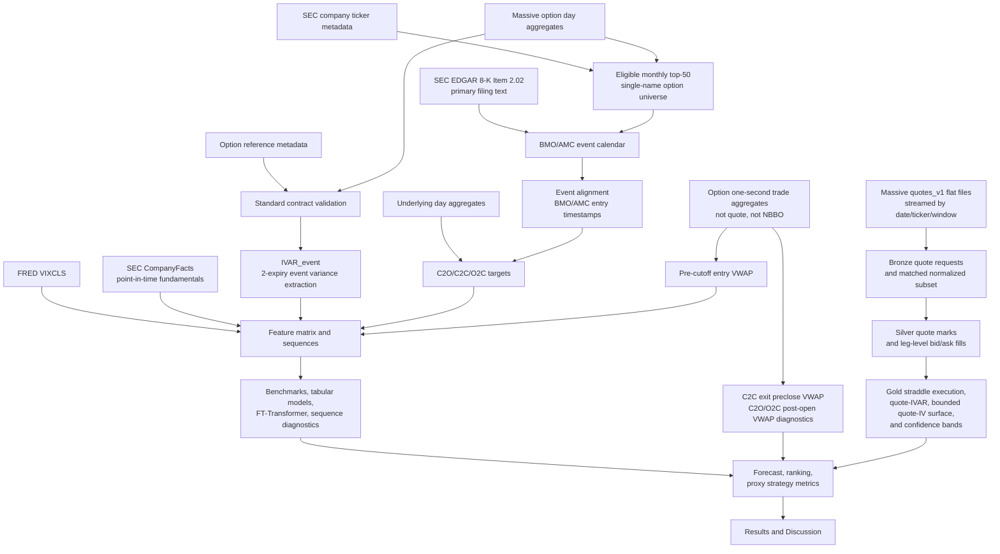

---
hide:
  - navigation
---

# Paper Plan

Working title:

**Can Machine Learning Improve Earnings Event-Variance Trading? Evidence from
U.S. Equity Options**

This page is the manuscript plan. It is written in paper order and keeps the
current evidence boundary explicit: all current market-trade results are based
on a `no_nbbo_trade_proxy` route and are not paper-grade executable trading
evidence.

The intended structure is a paper outline, not an engineering changelog:
abstract, introduction, materials and methods, expected experiments, planned
results and discussion, limitations, conclusion, and appendices. Each section
should answer the same questions a reader would ask in a manuscript: why the
problem matters, what the literature already implies, what gap remains, what
the paper contributes, what data and preprocessing create the sample, what
models and metrics are used, which experiments are expected, and what evidence
would be enough to support or reject the claim.

## Abstract

This paper asks whether machine-learning models can improve trading decisions
around option-implied earnings event variance mispricing. The object is not
generic implied-volatility forecasting. Models forecast realized earnings-event
variance, the market benchmark is option-implied event variance
`IVAR_event`, and the tradable question is whether predicted mispricing improves
premium-space trade selection after costs.

The intended current target-window rebuild uses a SEC-first earnings calendar
and Massive market-data proxy route for U.S. single-name equity options from
2016-10-01 through 2026-06-05. The 2026-06-12 Mac preflight snapshot was built
on the broader 2016-01-01 window and
contains 3,072 BMO/AMC main-sample candidate events and 80,275 contract
candidates. Contract-reference validation, trade-proxy second aggregates, and
the gold feature matrix were rebuilt for that preflight window; the main
2016-10-01 window should be rebuilt on the remote data device before citation.
Model/report artifacts still need a main-window rerun on a stable LightGBM
runtime. The primary scientific target is close-to-open earnings jump variance
(`jump_c2o`);
the current proxy-PnL headline is close-to-close event variance (`day_c2c`);
post-open digestion (`reaction_o2c`) is diagnostic.

Historical model rows are stale after the 2016-2026 feature refresh and should
not be cited as current evidence. The current verified target-window
trade-proxy aggregate remains negative before model selection
(`mean_gross_proxy_pnl_usd=-93.90`, `mean_haircut_pnl_usd=-221.04`), so the
defensible conclusion remains preliminary signal-screening and benchmark
discipline, not executable trading outperformance. Paper-grade claims require
historical quote/NBBO or equivalent data, full-sample quote-based IVAR
diagnostics, leg-level execution with
realistic bid/ask or NBBO-equivalent crossing.

## 1. Introduction

### 1.1 Overview and Motivation

Earnings announcements create scheduled jumps in uncertainty. Short-dated
options embed the market's expectation of this event variance, but the
empirical question is whether pre-event information can improve the
cross-sectional ranking of expected event-variance mispricing.

This matters because the usual IV-forecasting framing is too broad for the
trade being studied. A trader does not need a better unconditional volatility
forecast; they need to know whether the event variance embedded in the option
premium is too high or too low relative to the realized event move, and whether
that difference is large enough to survive costs. The paper therefore treats
forecast accuracy as one layer of evidence and economic selection as the
binding test.

The work is useful only if it is event-specific. Earnings releases are dated,
repeatable information shocks with observable pre-event option premia, realized
post-event moves, and natural long-volatility trade expressions. That makes
them a cleaner laboratory than broad implied-volatility forecasting: the paper
can define the information set before the release, measure the realized event
move after the release, and test whether a model improves the ranking of
mispriced events before costs and execution assumptions blur the result.

The paper-facing question is:

> Can models improve trading decisions around option-implied earnings event
> variance mispricing?

The research object is the gap between realized event variance and the
option-implied event variance benchmark:

```text
RVAR_event - IVAR_event
```

The tradable proxy label uses close-to-close event variance:

```text
RVAR_event_day_c2c - IVAR_event
```

The decision layer is premium-space and cost-aware:

```text
expected_strategy_edge_usd
  = expected_strategy_value_usd - market_entry_cost_usd
```

Forecast error is therefore only supporting evidence. A useful model must
improve ranking, tail selection, and proxy net performance in the tradable
tail.

### 1.2 Literature Review and Existing Results

This paper sits at the intersection of scheduled-jump option pricing,
earnings-option return predictability, RV-IV spread signals, and empirical
asset-pricing ML.

| Literature stream | Existing result shape | Role in this paper |
| --- | --- | --- |
| Earnings option pricing and scheduled jumps | Short-dated options price a discrete earnings uncertainty component. | Motivates extracting event variance rather than forecasting total IV. |
| Earnings straddle-return studies | Average earnings option returns depend on implied uncertainty, realized moves, and costs. | Motivates testing event-level trade selection instead of only average straddle returns. |
| RV-IV spread and option-return predictability | Realized-minus-implied variance spreads can predict option returns in some settings. | Provides a required classical benchmark through a Goyal-Saretto-style spread. |
| Empirical asset pricing with ML | ML claims need out-of-sample ranking, economic value, and strong tabular baselines. | Requires LightGBM/XGBoost and validation-only tuning before deep-model claims. |
| Surface and sequence modeling | Ordered option-surface paths may contain incremental pre-event information. | Motivates FT-Transformer, ridge-flat, attention, CNN, mask-only, and time-shuffle diagnostics. |

The current in-repo data and feature artifacts are proxy-stage only, and the
latest Mac materialization is a broader pre-window-change preflight snapshot.
Historical 2026-06-11 model metrics predate the refreshed feature matrix and
should not be cited as current evidence. Model-stage results, including
Goyal-Saretto, LightGBM/XGBoost, ensemble, FT-Transformer, and sequence rows,
need a rerun on the 2016-10-01 main-window `fe_v2_sec_xbrl` matrix before paper
claims. The current paper plan should treat the populated 2026-06-11 model
snapshot as historical local evidence until the data, feature, model, and
report stages are rebuilt on the active main window.

### 1.3 Research Gap

The gap is not whether implied volatility can be predicted in general. The gap
is whether pre-event state, event history, and option-surface proxy features can
sort earnings events by realized event-variance mispricing in a way that
survives transaction-cost-aware option trade selection.

The key missing discipline in a weak formulation would be:

- treating lower RMSE as sufficient even if ranking and net PnL do not improve;
- claiming sequence-model value without LightGBM/XGBoost and RV-IV spread
  benchmarks;
- reporting second-aggregate trade bars as executable bid/ask or NBBO results;
- using C2O or O2C diagnostic decompositions as headline strategy evidence.

This project closes that gap only at proxy-stage. It does not yet close the
paper-grade execution-data gap.

### 1.4 Research Questions and Hypotheses

Primary research question:

- Do models improve the ranking of earnings event-variance mispricing relative
  to market-implied `IVAR_event` and simple historical baselines?

Secondary questions:

- Do the current low-dimensional state/history additions improve ranking and
  economics relative to market IVAR and classical baselines?
- Do ordered pre-event proxy-surface sequences add incremental value beyond
  event-level tabular aggregates?
- Does ranking improvement translate into `day_c2c` premium-space proxy
  economics after costs?
- Are C2O jump forecasts and O2C post-open digestion forecasts useful
  scientific diagnostics even when they are not headline strategy evidence?

Expected hypotheses before running paper-grade data:

| Hypothesis | Evidence needed |
| --- | --- |
| Market IVAR is a strong level benchmark but not necessarily an optimal ranking signal. | OOS R2, AUC, top-decile precision, and edge-decile monotonicity versus IVAR. |
| State/history features may help sort event-variance mispricing under small proxy samples. | Locked validation/test ranking, edge-decile monotonicity, and premium-space proxy economics. |
| Sequence models should not be sold unless they beat tabular baselines and mask/time-shuffle controls. | Common-row sequence diagnostics and bootstrap/inference checks. |
| Trade value requires premium-space selection, not raw variance-edge ranking alone. | Net proxy PnL, cost sensitivity, drawdown, and turnover. |

### 1.5 Contribution

The intended contribution is empirical and protocol-driven, not a model-family
claim:

> State and event-history features contain preliminary cross-sectional signal
> for earnings event-variance mispricing beyond market-implied IVAR and simple
> historical baselines.

The paper contributes:

- a leakage-controlled event-variance target system separating `jump_c2o`,
  `day_c2c`, and `reaction_o2c`;
- a SEC-first earnings-event calendar and dynamic liquid single-name option
  universe;
- a market IVAR benchmark extracted from short-dated option proxies;
- a benchmark suite that includes market IVAR, historical baselines,
  Goyal-Saretto-style spread, Elastic Net, LightGBM/XGBoost, FT-Transformer,
  and sequence diagnostics;
- a premium-space proxy strategy layer that separates forecast fit from
  tradable selection;
- a conservative evidence hierarchy separating no-NBBO signal screening from
  paper-grade execution.

## 2. Materials and Methods

### 2.1 Data Sources and Market Description

The current data route uses official SEC filings for event identification and
Massive market-data proxies for prices:

| Source | Use |
| --- | --- |
| SEC EDGAR 8-K / 8-K/A Item 2.02 filings | Earnings-event discovery and SEC primary-document text validation. |
| SEC company ticker metadata | Common-equity-like single-name eligibility and CIK mapping. |
| SEC CompanyFacts | Public XBRL fundamentals with point-in-time gating. |
| Massive options day aggregates | Universe liquidity ranking, contract discovery, close-trade-implied IV proxies, and daily sequences. |
| Massive option contract reference metadata | Multiplier and deliverable diagnostics. |
| Massive underlying day aggregates | Event returns, vendor OHLC opens, exit spot, and run-up features. |
| Massive option one-second aggregates | Pre-cutoff entry VWAP, C2C exit preclose VWAP, and C2O/O2C post-open diagnostic marks. |
| FRED VIXCLS | Prior-close daily market-state controls. |

All current option second aggregates are trade OHLCV bars. They are not quote
midpoints, bid/ask records, OPRA, or NBBO. The current panel grade is
`no_nbbo_trade_proxy`; `paper_grade=false`.

The market object is a U.S. single-name earnings-event option setup. The unit
of observation is an event for a liquid optionable common-equity-like
underlying, with BMO/AMC timing mapped to a pre-release entry timestamp and
post-release close/open/close outcomes. The economic proxy is a short-dated
ATM straddle-style premium decision around the event. This is why the data
description must report option entitlement, event timing, DTE windows,
contract standardness, IVAR coverage, entry/exit mark construction, and the
absence of quote/NBBO execution evidence before presenting model results.

### 2.2 Sample, Universe, and Event Timing

The active main data window targets 2016-10-01 through 2026-06-05.
The current lake-quality audit makes the remaining paper-grade gap explicit:
options day aggregates are available over the target span and the main window
starts after the observed 2016-H1 underlying daily entitlement gap. Full
bid/ask/NBBO or equivalent quote coverage is still not available. The
pre-window-change no-NBBO trade-proxy feature matrix has 3,071 rows, 559
columns, and 415 model features; rebuild it for the 2016-10-01 main window
before citing current-window model results.

The universe is dynamic. Each month, eligible U.S. single-name option
underlyings are ranked by trailing six-month option premium dollar volume:

```text
option_premium_dollar_volume = option_price * contract_volume * 100
```

ETF, fund, trust, ETN, index, volatility, commodity, and other non-single-name
symbols are excluded before top-50 selection. BMO and AMC events are retained;
DMH and unknown timing are excluded from the main sample.

### 2.3 Target Construction

The realized-variance target system is:

```text
RVAR_event_jump_c2o     = log(open_after / close_before)^2
RVAR_event_day_c2c      = log(close_after / close_before)^2
RVAR_event_reaction_o2c = log(close_after / open_after)^2
```

The return identity is:

```text
r_event_day_c2c = r_event_jump_c2o + r_event_reaction_o2c
```

Variance reconstruction therefore records the cross term:

```text
RVAR_cross_term = 2 * r_event_jump_c2o * r_event_reaction_o2c
```

Roles:

| Target | Role |
| --- | --- |
| `jump_c2o` | Primary scientific ranking target for the earnings jump. |
| `day_c2c` | Literature-compatible target and current proxy-PnL headline. |
| `reaction_o2c` | Diagnostic post-open digestion target. |

### 2.4 IVAR Construction

For two event-covering expiries, total ATM implied variance is:

```text
w(T) = sigma_ATM(T)^2 * T
```

The implied event variance is extracted as:

```text
IVAR_event = (T2*w1 - T1*w2) / (T2 - T1)
```

Negative extracted event variance and nonmonotone total variance are excluded
from tradable samples and reported as diagnostics.

### 2.5 Preprocessing, Pretreatment, and Leakage Control

The preprocessing protocol is designed around as-of validity:

```text
feature_asof_timestamp <= event_entry_timestamp
```

Pretreatment is applied before model fitting so that every row has a clearly
defined information set, target, and execution grade.

| Pretreatment step | Rule | Reason |
| --- | --- | --- |
| Event timing | AMC events enter before the announcement-date close; BMO events enter before the previous trading-day close. | Keeps the signal before the earnings release. |
| Target alignment | C2O, C2C, and O2C labels share the same event id and are split together. | Prevents target variants from leaking across train/validation/test. |
| Underlying opens | Vendor daily OHLC opens are labeled as `vendor_regular_ohlc_assumed`, not verified auction prints. | Avoids overclaiming open-auction execution quality. |
| CompanyFacts | Use `acceptanceDateTime <= feature_asof_timestamp` when mapped; otherwise require `filed < feature_asof_date`. | Keeps public fundamental features point-in-time. |
| Option contracts | Require standard 100-share deliverables where reference metadata are available. | Avoids adjusted contracts contaminating IVAR and proxy PnL. |
| Entry prices | Use pre-cutoff option one-second trade aggregates only. | Keeps entry marks before the model signal timestamp. |
| Exit prices | Use C2C exit preclose VWAP and C2O/O2C post-open VWAP only as no-NBBO trade proxies. | Separates signal screening from executable quote evidence. |
| Feature exclusion | Drop same-event realized fields, post-event outcomes, exit marks, PnL columns, and post-open outcomes. | Prevents direct leakage into trainable models. |
| Transform fitting | Fit normalization, ranks, and selected transforms on train rows only. | Prevents locked-test distribution leakage. |
| Splitting | Use chronological event-level 70/15/15 splits. | Preserves temporal ordering and keeps target variants together. |

The leakage audit is intentionally conservative. If a field can be interpreted
as an outcome, execution mark, post-open value, or raw identifier, it is
excluded unless the feature schema explicitly records why it belongs in the
pre-entry information set.

### 2.6 Data Pipeline

The pipeline separates event discovery, market-data construction, feature
engineering, model training, and proxy backtesting. The diagram keeps the
execution caveat explicit: the canonical strategy prices are trade-aggregate
proxies, while quote data enters only through targeted event-window extraction.



Executable stages are exposed through `just data` and `just research`. The
data DAG builds the event panel and trade-proxy inputs; the research DAG builds
features, sequence tensors, model predictions, metrics, figures, and the
generated report. `just research` does not download market data, so stale data
artifacts must be checked before a refreshed paper run is claimed.

In the manuscript, this subsection should read as the preprocessing and
pretreatment protocol. It should show the data flow, then state exactly which
artifacts certify the run: event-calendar report, event-window panel report,
contract-reference validation manifest, trade-proxy panel report, feature
schema report, transform parameters, research manifest, metric tables, and
figure outputs. A refreshed run is not paper-facing until these artifacts and
the curated results page agree on sample size, IVAR coverage, feature schema,
model rows, and evidence grade.

### 2.7 Feature Engineering

The default and only supported research schema is `fe_v2_sec_xbrl`. The
resolved run-level allowlist is
`artifacts/modeling/feature_schema_report.csv`, and only
`model_feature=true` rows enter trainable models.

Feature families:

| Family | Examples | Selection criterion |
| --- | --- | --- |
| Event-level option state | `IVAR_event`, ATM IV, term spread, skew, butterfly proxies | Pre-entry option-surface proxy state. |
| Liquidity and execution proxy | entry premium, option volume, transactions, call/put volume imbalance, latest bar age | Allowed because signal timestamp equals completed entry window. |
| Realized history | own-underlying pre-event return/RV run-up, prior same-ticker earnings moves | Strictly prior events or pre-entry trading days. |
| Market covariates | VIX level/change/percentile/regime, SPY/QQQ controls when available | Prior-close or pre-cutoff alignment. |
| SEC XBRL fundamentals | assets, liabilities, revenue, profitability proxies | Conservative acceptance-time or filed-date gating. |
| SEC SIC coarse controls | broad SIC/sector group flags | Static company metadata, used as coarse controls rather than alpha claims. |
| Train-fitted transforms | z-scores, ranks, normalized features | Fit on train only; applied to validation/test. |
| Single-name run-up and surface proxies | run-up returns, weak delta-grid and RND-like proxy features | Trade-implied proxy language only. |
| Daily sequences | 20 pre-entry daily surface states | Close-trade-implied daily proxy surfaces. |
| Hybrid sequences | 31 steps: 19 daily states plus 12 entry-day five-minute bins | Mixed-clock pre-entry proxy path. |

The broader pre-window-change `feature_schema_report.csv` has 559 total columns
and 415 `model_feature=true` columns. Low-dimensional additions include
sequence call/put volume imbalance aggregates, own-underlying pre-event
return/RV run-up, and SEC SIC coarse controls. Rebuild the report for the
2016-10-01 main window before citing those counts as current sample evidence.

The current schema excludes raw numeric identifiers, raw year/month,
exit/outcome/PnL fields, post-event labels, and unsupported quote/NBBO claims.

The feature section in the final paper should report both the intended feature
families and the realized run-level schema: feature counts, coverage, excluded
families, and the reason each high-risk field is rejected. The current run
records this in `artifacts/modeling/feature_schema_report.csv` and
`artifacts/modeling/feature_transform_params.json`.

### 2.8 Models

| Family | Models | Purpose |
| --- | --- | --- |
| Market benchmark | Market-implied IVAR | Central level and no-edge baseline. |
| Historical baselines | Last-four RVAR, last-four IVAR | Tests whether simple earnings history is enough. |
| Classical mispricing benchmark | Goyal-Saretto-style RV-IV spread | Required option-return predictability comparator. |
| Linear tabular | Elastic Net | Sparse linear event-level benchmark using sklearn `ElasticNetCV`. |
| Nonlinear tabular | LightGBM, XGBoost | Main current contenders with validation-only tuning. |
| Ensemble | LightGBM/XGBoost forecast ensemble | Equal-weight average of calibrated variance forecasts from tuned LightGBM and XGBoost. |
| Neural tabular | FT-Transformer | Validation-tuned deep tabular comparator. |
| Sequence diagnostics | Ridge-flat aggregates, attention pooling, non-causal dilated CNN, mask-only, time-shuffle | Tests whether ordered pre-event paths add value. |

The active sequence suite is intentionally lightweight. It does not include
slow recurrent or SSM 5-seed ensembles, and it should not require an external
CUDA sequence package. Mask-only and time-shuffle remain control rows, but
after the runtime cleanup their numeric results must be regenerated before they
are used as current-code evidence.

The canonical profile is `tuned_phase1_day_c2c_rank_log_rvar`. Tuning uses
train and locked-validation rows, selects on validation `day_c2c` edge-ranking
objectives, refits on train+validation, and evaluates locked-test rows once.
Elastic Net, LightGBM, XGBoost, and FT-Transformer train on
`log(max(RVAR, 0) + FORECAST_FLOOR)` with `FORECAST_FLOOR=1e-6`; their outputs
are back-transformed with `max(exp(pred_log) - FORECAST_FLOOR, FORECAST_FLOOR)`
before forecast metrics, ranking, strategy, IVAR-defeat, and casebook
artifacts. This aligns hyperparameter selection with the current proxy trading
screen, but it is not direct PnL optimization; proxy PnL is reported as
economic validation. `jump_c2o` remains a scientific decomposition target and
is still reported for forecast/ranking evidence under the same selected
hyperparameters to test cross-target generalization.
Paired original tabular rows and single-seed sequence rows are intentionally
not emitted in the current canonical results.

Configuration notes:

- Goyal-Saretto-style spread is a Goyal-Saretto-inspired earnings-event RV-IV
  spread benchmark, not a full replication of the original cross-sectional
  option-portfolio paper. It keeps the trailing RV-IV spread signed, clips only
  the final variance forecast at zero, and records whether the zero-spread
  fallback was used.
- XGBoost search now includes `max_depth` up to 6, lower learning-rate
  candidates, and a continuous uniform `min_child_weight` range `[3, 50]`
  rather than a five-point discrete grid. Trials with `best_iteration < 25`
  receive a 0.01 validation-objective penalty. This is a soft discouragement
  for unstable early-stopped trials, not a hard veto; the selected trial is
  chosen by the penalized objective rather than by raw AUC alone. The
  implementation fixes `tree_method="hist"` and controlled `n_jobs`.
- LightGBM keeps a broad validation-only tree search with early stopping,
  strong regularization candidates, `min_gain_to_split` candidates, and fixed
  LightGBM random seeds.
- The active LightGBM/XGBoost ensemble has dual outputs. The forecast column is
  an equal-weight average of raw variance forecasts and is used for
  forecast-level metrics, edge magnitude, and expected-edge USD. The ranking
  score is the split-level percentile-rank average of the base predicted edges
  `(forecast - IVAR_event)` and is used for ranking metrics, edge deciles, and
  top-k trade ordering. Strategy thresholds and expected-edge USD still use the
  raw forecast average.
- FT-Transformer uses validation MSE for within-trial early stopping, but
  hyperparameter selection uses the same validation edge-ranking objective as
  the other tuned models. Diagnostics explicitly record that the MSE/RMSE
  checkpoint can differ from the ranking-optimal checkpoint.
- Sequence diagnostics intentionally keep one lightweight layer and omit
  recurrent/SSM 5-seed ensembles. The loss-scale guard is computed once from
  the current training split only at candidate initialization; weights remain
  fixed during that candidate's training run. Pairwise ranking uses
  `forecast_RVAR - IVAR_event`, where `forecast_RVAR` is computed after
  log-output back-transformation in raw variance space.
- Ridge-flat sequence aggregates use a direct Ridge fit because aggregate
  sequence features are highly collinear.
- The populated numeric snapshot predates this log-target canonical profile.
  Existing figures and tables remain historical until the model stage is rerun
  and writes new selected params, diagnostics, and metrics under
  `tuned_phase1_day_c2c_rank_log_rvar`.

### 2.9 Performance Metrics and Selection Criteria

Metric choice follows the paper question: level forecast accuracy is useful,
but ranking and economic selection are the paper-facing objectives.

| Metric family | Metrics | Selection reason |
| --- | --- | --- |
| Forecast | MAE, RMSE, QLIKE diagnostic, OOS R2 versus IVAR | Tests whether a model improves realized-variance level forecasts. |
| Ranking | AUC, top-decile precision, Brier diagnostic, calibration diagnostics, edge-decile monotonicity | Tests whether a model sorts mispricing opportunities. |
| Strategy | Gross/net proxy PnL, return on premium/capital, Sharpe, Sortino, max drawdown, hit rate, average win/loss, tail loss, turnover | Tests whether ranking maps into premium-space trade outcomes. |
| Robustness and risk | Cost sensitivity, IVAR failure counts, sequence drop rate, extreme prediction diagnostics, bootstrap/inference diagnostics | Tests whether the result survives data screens, costs, and sample risk. |

Selection discipline:

- `day_c2c` is the default hyperparameter-selection target and the only current
  proxy-PnL headline target.
- `jump_c2o` is a primary scientific decomposition target for the earnings
  jump and remains a reported forecast/ranking table, but it is not the
  default tuning target.
- `reaction_o2c` is diagnostic because full-event `IVAR_event` is a weak
  comparator for post-open realized variance.
- Lower RMSE alone is not enough. A model must improve ranking and/or economic
  selection to be paper-relevant.
- Sequence models cannot be a headline unless they beat strong tabular
  baselines and mask/time-shuffle controls on common rows.

Model selection and paper interpretation are separate. Hyperparameters are
chosen only with train and validation rows; the locked test set is used once
for the reported tables. A result becomes paper-relevant only if the locked-test
evidence is coherent across forecast fit, ranking, premium-space economics,
and robustness diagnostics.

### 2.10 Strategy Layer

The current proxy strategy is a long ATM straddle when predicted
event-variance edge is positive and clears a premium-space transaction-cost
threshold. Negative variance-edge rows remain diagnostics; the current proxy
route does not open naked short straddles.

Entry and exit marks:

| Mark | Current proxy implementation |
| --- | --- |
| Entry | Per-leg option VWAP over the final 900 seconds before event cutoff. |
| C2C exit | Same-contract option VWAP over the final 15 minutes before exit-date close. |
| C2O post-open diagnostic | Same-contract option VWAP from 5-15 minutes after the regular-session open; 0-5 minutes is a microstructure stress test. |
| O2C diagnostic entry | Same 5-15 minute post-open option VWAP anchor. |

The config also records short iron fly as a paper strategy design, but the
current no-NBBO proxy headline is long-straddle selection. Paper-grade short
iron fly claims require quote/NBBO legs and realistic bid/ask crossing.

## 3. Expected Experiments

The expected experiment set is designed to separate signal screening from final
paper-grade execution.

This section is the pre-results ledger. Every experiment listed here should
have a matching row or subsection in [Results and Discussion](results_snapshot.md)
with four things: the table or figure used, the observed outcome, the
interpretation, and the claim boundary. If a run generates a new model or
robustness check, it should either enter this ledger or be explicitly labeled
as exploratory.

### 3.1 Completed Proxy-Stage Experiments

| Experiment | Purpose | Current status |
| --- | --- | --- |
| Canonical `fe_v2_sec_xbrl` tuned package | Default feature-schema evidence ledger. | Data and feature stages rebuilt for 2016-2026; model/report stages still need rerun. |
| Benchmark ladder | Compares market IVAR, historical baselines, Goyal-Saretto spread, Elastic Net, LightGBM/XGBoost. | Completed. |
| Full sequence diagnostic suite | Tests ordered proxy-surface paths against mask/time-shuffle controls. | Active suite is ridge-flat, attention pooling, dilated CNN, mask-only, and time-shuffle; sequence rows remain diagnostic because the primary gate does not pass. |
| C2C proxy strategy | Tests premium-space headline economics. | Completed for no-NBBO long-straddle proxy. |
| C2O and O2C diagnostics | Decomposes jump and post-open digestion evidence. | Completed as diagnostic outputs. |
| Cost sensitivity and inference diagnostics | Stress-tests proxy economics and forecast losses. | Completed at proxy-stage. |

Each completed experiment should have an explicit outcome row in the results
section: best model, best metric, economic interpretation, and claim boundary.
The current implementation of that ledger is in
[Results and Discussion](results_snapshot.md).

### 3.2 Required Paper-Grade Experiments

| Experiment | Required for |
| --- | --- |
| Targeted `quotes_v1` extraction and quote execution panel | Converts quote flat-file availability into event/leg/window bid-ask evidence without storing full-day raw quote files. |
| Quote-aware execution confidence | Stratifies strategy and ranking results by quote availability, stale quote, spread, invalid bid/ask, and fallback flags. |
| Lake quality audit | Verifies bronze/silver/gold date ranges, rows, partitions, quote coverage, and target-window blockers. |
| IVAR defeat analysis | Tests where each model actually beats market `IVAR_event`, where it only repeats market information, and where market IVAR remains better. |
| False-positive / false-negative casebook | Turns model failures and market-vs-model disagreements into reusable research diagnostics. |
| Robustness summary gates | Summarizes DTE, liquidity, VIX-regime, BMO/AMC, ticker, year, and quote-confidence subgroup coverage and flags small-cell splits. |
| Historical quote/NBBO or equivalent data route | Paper-grade IVAR and executable bid/ask strategy claims beyond the current targeted extraction prototype. |
| Quote-based IVAR reconstruction | Replacing trade-aggregate IV proxies. |
| Leg-level bid/ask execution | Full-spread long straddle and short iron fly tests. |
| 2016-10-01 to 2026-06-05 full sample rebuild | Target paper sample and longer-history inference. |
| DTE 5-14 main and DTE 3-21 robustness reruns | Maturity-window robustness. |
| Liquidity, year, ticker, sector, VIX-regime, and BMO/AMC subgroup tables | Stability and concentration diagnostics. |
| Block/bootstrap or model-comparison inference | Final statistical claims under multiple models/thresholds. |

The quote route status has changed from a pure entitlement blocker to an
engineering/data-coverage blocker. The Massive `quotes_v1` flat-file object is
visible, but single-day compressed files are too large for naive full-day
download into the research repo. Targeted Massive REST quote windows now work
for option tickers, and the current bounded consolidated slice has populated
502 events, 14,366 quote-window requests, 10,921,438 matched quote rows, quote
marks, leg execution rows, straddle execution rows, quote-IVAR diagnostics,
bounded quote-IV surface diagnostics, and confidence bands. The bounded surface
contains 7,164 finite `quote_mid_iv` leg values, 3,573 finite quote
mid-total-variance surface-pair rows, and 471 finite surface-IVAR mid rows. The
required full implementation remains keyed by event date, candidate option
ticker, and entry/exit windows. The quote step now supports resumable
batch slices via `--quote-event-offset`, `--max-events`, and
`--quote-batch-label`; batch-labeled runs write under `batches/batch=...` and
do not overwrite the canonical bounded slice. A separate
`quote-execution-merge` stage consolidates verified batch shards into the
canonical quote lake and research-facing CSV/report artifacts. Its data-lake
contract is:

| Lake layer | Quote artifact | Purpose |
| --- | --- | --- |
| Bronze | `quote_window_requests.parquet`, `quote_window_quotes.parquet` | Request table and matched normalized quote subset only; no full-day raw quote files. |
| Silver | `quote_window_marks.parquet`, `quote_execution_legs.parquet` | Selected window marks and leg-level buy/sell bid-ask execution diagnostics. |
| Gold | `quote_straddle_execution.parquet`, `quote_ivar_event.parquet`, `quote_iv_surface.parquet`, `quote_iv_surface_summary.parquet`, `quote_surface_ivar_event.parquet`, `quote_execution_confidence.parquet` | Event/strike straddle execution diagnostics, diagnostic quote-premium variance proxy, bounded quote-IV surface diagnostics, bounded surface-IVAR diagnostics, and event-level confidence bands. |

The data-readiness contract is tracked by
`artifacts/data_pipeline/lake_quality_audit/`. The audit must become `ok=true`
for the 2016-10-01 to 2026-06-05 target window before the paper can claim full
historical coverage or paper-grade quote execution.

Its minimum paper-facing artifacts are:

| Module | Required artifacts | Claim boundary |
| --- | --- | --- |
| Quote-aware execution confidence and bounded quote-IV surface | `quote_window_requests.csv`, `quote_window_quotes.csv`, `quote_window_marks.csv`, `quote_execution_legs.csv`, `quote_straddle_execution.csv`, `quote_ivar_event.csv`, `quote_iv_surface.csv`, `quote_iv_surface_summary.csv`, `quote_surface_ivar_event.csv`, `quote_execution_confidence.csv`, `quote_execution_report.json`, `quote_confidence_prediction_coverage.csv`, `quote_ivar_summary.csv`, `quote_confidence_strategy_summary.csv`, `quote_confidence_ivar_defeat_summary.csv`, `quote_confidence_casebook_summary.csv` | Quote-aware diagnostic, not final NBBO execution unless the source is verified as NBBO-equivalent. `quote_ivar_event` remains a premium-total-variance proxy; the new quote-IV surface artifacts are bounded diagnostics, not full target-window NBBO-equivalent surface coverage. |
| Lake quality audit | `lake_dataset_coverage.csv`, `lake_year_coverage.csv`, `lake_quality_report.json` | Required negative/positive gate for target-window coverage; not a modeling result. |
| Completion gap audit | `completion_gap_audit.csv`, `completion_gap_audit.json` | Machine-readable target-vs-evidence ledger; required to keep bounded quote/sequence progress separate from unresolved target-window coverage, NBBO-equivalent execution, and full historical quote-IV surface blockers. |
| IVAR defeat analysis | `ivar_defeat_events.csv`, `ivar_defeat_metrics.csv`, `ivar_defeat_breakdowns.csv` | Model-vs-market interpretation on locked-test rows; not a new tuning signal. |
| Casebook | `casebook_events.csv`, `casebook_summary.csv` | Research interpretation and failure taxonomy; not manual sample repair. |
| Robustness summary | `strategy_breakdowns.csv`, `ivar_defeat_breakdowns.csv`, `robustness_summary.csv` | Current proxy-stage subgroup evidence. Small-cell strategy splits are exploratory; paper-grade robustness still requires the full historical/quote sample. |

### 3.3 Decision Rules for the Paper

| Outcome | Paper interpretation |
| --- | --- |
| Current tabular models beat market IVAR and classical baselines after costs | Sell an earnings event-variance mispricing ranking paper. |
| Sequence models beat tabular baselines and controls on common rows | Add a secondary contribution on ordered pre-event proxy-surface paths. |
| Market IVAR and Goyal-Saretto-style spread dominate | Sell a hard-to-beat market-efficiency result with strong benchmarks. |
| Proxy signal disappears under quote/NBBO execution | Keep proxy evidence as signal screening and report realistic execution limits. |

## 4. Planned Results and Discussion Structure

The results page should carry the full evidence ledger in paper order:

1. Sample construction and execution-grade diagnostics.
2. Forecast results for `jump_c2o`, `day_c2c`, and `reaction_o2c`.
3. Ranking and top-decile evidence.
4. Premium-space C2C proxy strategy results.
5. C2O and O2C diagnostic decompositions.
6. Feature schema, leakage controls, and feature-family coverage.
7. Sequence diagnostics and control comparisons.
8. Cost sensitivity and inference diagnostics.
9. Quote-aware execution confidence, IVAR defeat analysis, and casebook
   roadmap/results when artifacts exist.
10. Discussion: sellable claim, non-results, limitations, and next
   paper-grade experiments.

The current detailed implementation of that section is
[Results and Discussion](results_snapshot.md).

## 5. Limitations

| Limitation | Consequence |
| --- | --- |
| Quote execution panel is only populated for a bounded slice | The pipeline can build targeted requests, matched quote subsets, leg fills, straddle diagnostics, and confidence bands, but the current results snapshot still cannot claim full-spread executable strategy performance. |
| `quotes_v1` flat-file object is large | Requires targeted extraction; full-day raw quote files should not be stored as repo artifacts. |
| Option second aggregates are trade OHLCV bars | IV surfaces and strategy marks are trade-price proxies. |
| Model/report outputs still need main-window rerun | The main window is now 2016-10-01 to 2026-06-05; current PnL and selected-parameter claims require data/features/models/reports to be rebuilt on that main-window matrix. |
| IVAR coverage screen is material | Events without usable trade-proxy IVAR cannot enter IVAR-based strategy claims. |
| Sequence eligibility screen is material | Sequence results carry selection risk and remain diagnostic. |
| C2O/O2C option PnL is diagnostic | The tradable mispricing headline remains `day_c2c`. |
| Proxy haircut cost model | Full bid/ask crossing remains future paper-grade work. |

## 6. Conclusion

The current proxy-stage evidence supports a disciplined, limited conclusion.
The project has a leakage-controlled `fe_v2_sec_xbrl` feature schema, strong benchmark
discipline, and useful diagnostics, but the current local model/report outputs
have not yet been rerun on the refreshed 2016-2026 feature matrix and do not
establish positive paper-grade `day_c2c` premium-space economics.

The result is not a final execution claim. It is a credible signal-screening
result that justifies either a paper-grade quote/NBBO extension or a
conservative proxy-stage manuscript.

## Appendix Plan

| Appendix | Contents |
| --- | --- |
| A. Literature and Positioning | Earnings option pricing, event volatility, option-return predictability, and ML comparisons. |
| B. Universe Construction | Monthly top-50 membership, turnover, exclusions, and liquidity distributions. |
| C. Event Calendar Audit | SEC accessions, timing flags, text validation, and BMO/AMC exclusions. |
| D. IVAR Diagnostics | Expiry selection, DTEs, total variances, negative IVAR, and nonmonotone failures. |
| E. Feature Schema | Event-level, VIX, SPY/QQQ, daily sequence, hybrid sequence, and as-of timestamps. |
| F. Model Configuration | Splits, hyperparameters, seeds, training status, and fit diagnostics. |
| G. Robustness and Inference | DTE windows, liquidity buckets, timing splits, ticker/year concentration, clustered SEs, and bootstrap checks. |
