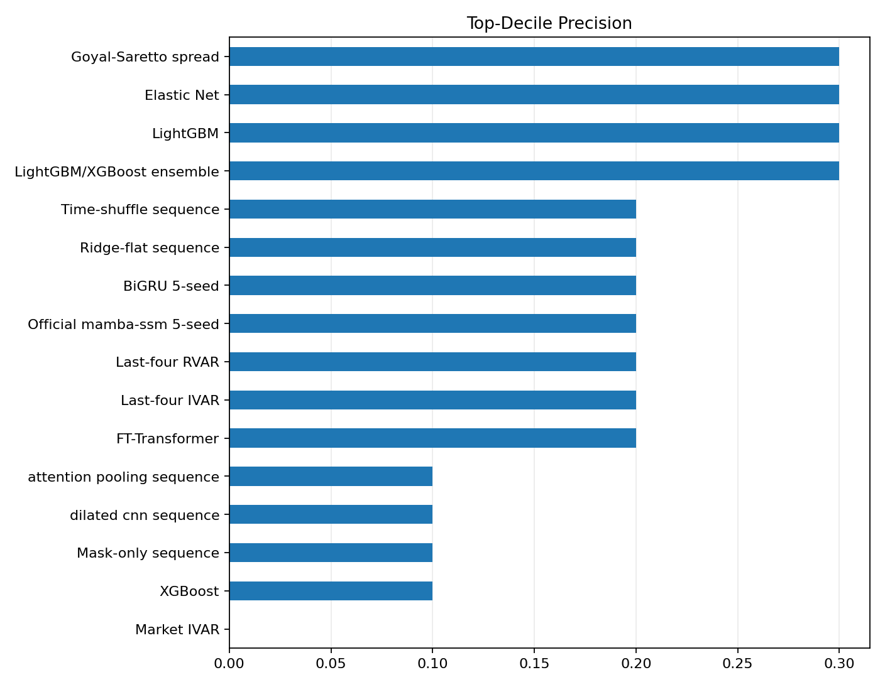
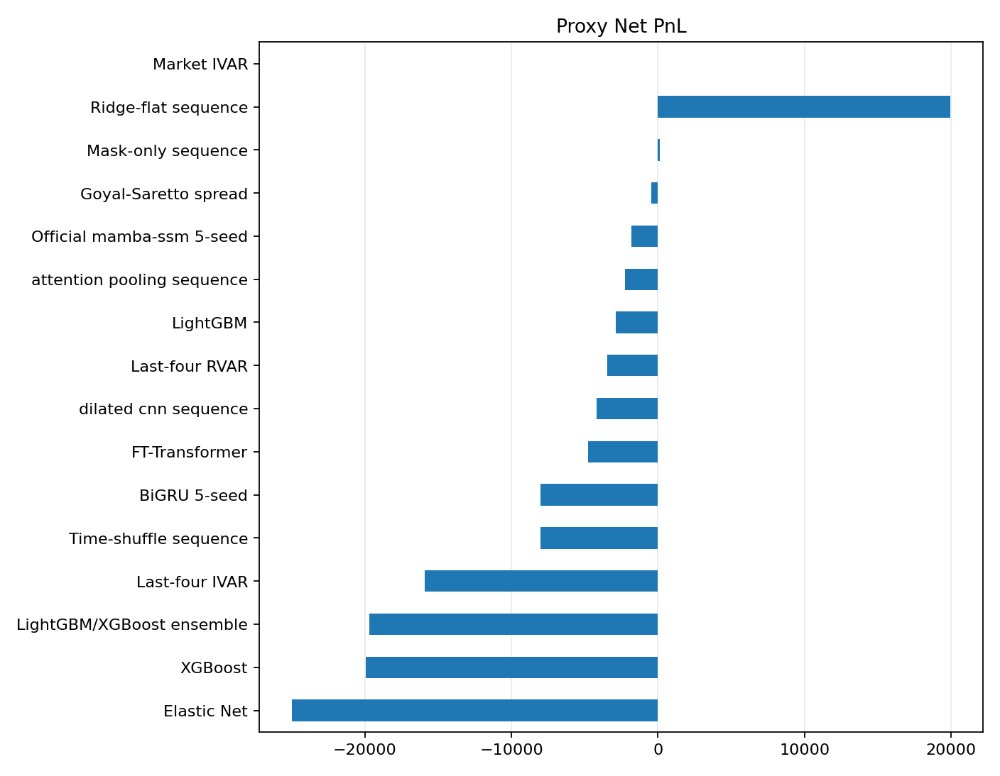
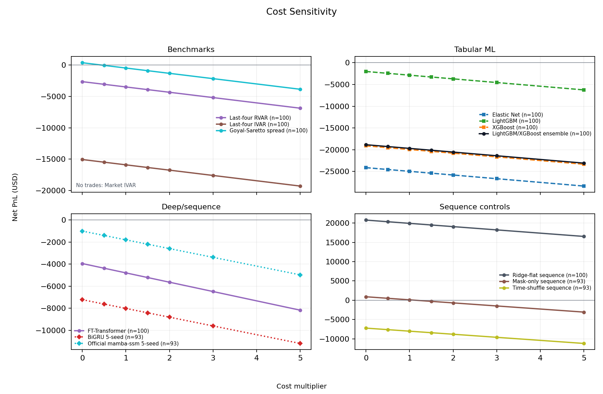

---
hide:
  - navigation
---

# Results Snapshot

This page is the current paper-facing ledger for the local canonical proxy run.
Generated outputs remain under ignored `artifacts/`, `reports/`, and external
`DATA_DIR` locations; selected figures are copied into
`docs/assets/images/modeling/`.

## Current Verdict

The repo has a complete no-NBBO proxy research package: data panel, model
implementations, feature-schema artifacts, validation-only tuning artifacts,
forecast/ranking/strategy tables, figures, and analysis notes.

It is good enough for internal research review and a conservative working-paper
draft. It is not good enough for paper-grade execution claims. All current
option prices are trade-aggregate proxies, not bid/ask, OPRA, or NBBO. The
execution grade remains `no_nbbo_trade_proxy`; `paper_grade=false`.

The 2026-05-12 same-code feature ablation is negative for FE V2: the default
`fe_v2_sec_xbrl` schema underperforms `fe_v1_legacy` on locked-test ranking and
headline C2C proxy economics. Per `SPEC.md`, this is reported as a diagnostic
finding rather than cherry-picked away.

## Research Question

The paper-facing question is:

> Can models improve trading decisions around option-implied earnings event
> variance mispricing?

This is not generic implied-volatility forecasting. Models forecast
`RVAR_event`; ex post mispricing is `RVAR_event - IVAR_event`; the trade layer
uses premium-space expected edge rather than raw variance edge alone.

| Target | Role | Definition |
| --- | --- | --- |
| `jump_c2o` | Primary scientific ranking target | close-to-open earnings jump variance |
| `day_c2c` | V1 proxy-PnL headline | close-to-close full reaction-day variance |
| `reaction_o2c` | Diagnostic target | open-to-close post-open digestion variance |

## Sample and Protocol

| Item | Current state |
| --- | --- |
| Verified local run | 2026-05-12 canonical tuned proxy package |
| Command | `just research args="--stage all --sequence-suite all --allow-high-sequence-risk --bootstrap-iter 1000 --tuning-profile tuned_phase1 --feature-schema-version fe_v2_sec_xbrl"` |
| Study window | 2022-12-01 to 2025-12-31 |
| Target paper window | 2013-2025, pending historical quote/NBBO or equivalent data |
| Universe | Monthly top 50 liquid U.S. single-name option underlyings |
| Main timing sample | BMO and AMC earnings announcements |
| Split | Chronological event-level 70/15/15 |
| Tuning protocol | `tuned_phase1`, train/validation-only selection, locked test once |
| Feature schema | `fe_v2_sec_xbrl` default; `fe_v1_legacy` retained for ablation |
| Bootstrap iterations | 1,000 |
| Research manifest | `artifacts/modeling/research_manifest.json`, `ok=true` |
| Ablation snapshots | `artifacts/modeling_ablations/fe_v2_sec_xbrl/`, `artifacts/modeling_ablations/fe_v1_legacy/` |

## Data Coverage

| Measure | Value |
| --- | ---: |
| Dynamic-calendar rows | 1,054 |
| BMO/AMC main-sample candidates | 810 |
| Trade-proxy event-panel rows | 810 |
| Events with C2C `rvar_event` alias | 801 |
| Events with trade-proxy `IVAR_event` | 693 |
| Proxy contract candidates | 12,038 |
| Contracts with usable pre-cutoff proxy price | 10,165 |
| Contracts with no trade in cutoff window | 1,873 |
| Contracts with local IV proxy | 10,138 |
| Main DTE 5-14 contracts | 5,098 |
| Robustness DTE 3-21 contracts | 12,038 |
| Proxy straddle diagnostic rows | 779 |

Sequence coverage remains diagnostic: 678 of 810 events are daily-sequence
eligible, the drop rate is 16.3%, and `high_sequence_selection_risk=true`.
The active hybrid tensor is `31 x 21`: 19 prior daily proxy-surface states plus
12 entry-day five-minute trade-aggregate proxy bins.

## Model Matrix

| Family | Models | Status |
| --- | --- | --- |
| Market benchmark | Market-implied `IVAR_event` | Active neutral edge baseline |
| Historical baselines | Last-four RVAR, last-four IVAR | Active deterministic baselines |
| Classical spread benchmark | Goyal-Saretto-style RV-IV spread | Active comparator |
| Linear tabular | Elastic Net | sklearn `ElasticNetCV` |
| Nonlinear tabular | LightGBM, XGBoost | Validation-only tuning and train+validation refit |
| Ensemble | LightGBM/XGBoost rank-average | Equal-weight tuned-base ensemble |
| Neural tabular | FT-Transformer | Validation-tuned; not a current headline model |
| Sequence diagnostics | Ridge-flat aggregates, BiGRU 5-seed, official `mamba-ssm` 5-seed, attention pooling, dilated CNN, mask-only, time-shuffle | Diagnostic only |

## FE V2 Canonical Result

Forecast/ranking columns use `jump_c2o`; strategy uses the `day_c2c`
headline proxy PnL. This is the active default schema.

| Model | MAE | RMSE | OOS R2 vs IVAR | Top-decile precision | AUC | Day-C2C net proxy PnL |
|:---|---:|---:|---:|---:|---:|---:|
| Market IVAR | 0.0097 | 0.0145 | 0.000 | 0.000 | 0.500 | n/a |
| Last-four RVAR | 0.0123 | 0.0293 | -1.787 | 0.200 | 0.505 | -3,482 |
| Last-four IVAR | 0.0181 | 0.0540 | -0.295 | 0.200 | 0.468 | -15,904 |
| Goyal-Saretto spread | 0.0076 | 0.0134 | 0.141 | 0.300 | 0.602 | -461 |
| Elastic Net | 0.0099 | 0.0212 | 0.125 | 0.300 | 0.493 | -24,967 |
| LightGBM | 0.0097 | 0.0209 | 0.203 | 0.300 | 0.510 | -2,862 |
| XGBoost | 0.0099 | 0.0211 | 0.142 | 0.100 | 0.515 | -19,952 |
| LightGBM/XGBoost ensemble | 0.0098 | 0.0210 | 0.175 | 0.300 | 0.512 | -19,694 |
| FT-Transformer | 0.0357 | 0.0384 | -4.766 | 0.200 | 0.524 | -4,793 |
| Ridge-flat sequence | 0.0110 | 0.0221 | -0.047 | 0.200 | 0.434 | 19,918 |
| Attention pooling sequence | 0.0088 | 0.0236 | 0.054 | 0.100 | 0.480 | -2,238 |
| Dilated CNN sequence | 0.0088 | 0.0233 | 0.116 | 0.100 | 0.476 | -4,172 |
| BiGRU 5-seed | 0.0087 | 0.0236 | 0.059 | 0.200 | 0.472 | -8,022 |
| Official `mamba-ssm` 5-seed | 0.0088 | 0.0239 | 0.024 | 0.200 | 0.501 | -1,793 |
| Mask-only sequence | 0.0088 | 0.0242 | -0.039 | 0.100 | 0.500 | 101 |
| Time-shuffle sequence | 0.0086 | 0.0237 | 0.056 | 0.200 | 0.475 | -8,022 |

**Interpretation.** FE V2 is not the current sell. The strongest FE V2
`jump_c2o` AUC is the Goyal-Saretto spread at 0.602. Tuned LightGBM/XGBoost
rows have weak `jump_c2o` AUC and negative `day_c2c` headline proxy PnL.
The positive ridge-flat sequence C2C row is diagnostic and does not pass the
sequence gate.

## FE V1 Versus FE V2 Ablation

| Feature schema | Target | Best AUC model | Best AUC | Best OOS R2 model | Best OOS R2 vs IVAR | Best headline/diagnostic PnL model | Best net PnL |
|:---|:---|:---|---:|:---|---:|:---|---:|
| `fe_v1_legacy` | `jump_c2o` | LightGBM | 0.677 | XGBoost | 0.375 | Official `mamba-ssm` 5-seed, C2O intrinsic diagnostic | 28,898 |
| `fe_v1_legacy` | `day_c2c` | LightGBM | 0.925 | XGBoost | 0.574 | LightGBM, C2C headline | 53,664 |
| `fe_v1_legacy` | `reaction_o2c` | Ridge-flat sequence | 0.799 | XGBoost | 0.949 | FT-Transformer, O2C diagnostic | 643 |
| `fe_v2_sec_xbrl` | `jump_c2o` | Goyal-Saretto spread | 0.602 | LightGBM | 0.203 | Official `mamba-ssm` 5-seed, C2O intrinsic diagnostic | 28,898 |
| `fe_v2_sec_xbrl` | `day_c2c` | Ridge-flat sequence | 0.636 | Ridge-flat sequence | 0.264 | Ridge-flat sequence, C2C headline | 19,918 |
| `fe_v2_sec_xbrl` | `reaction_o2c` | Ridge-flat sequence | 0.799 | LightGBM/XGBoost ensemble | 0.945 | FT-Transformer, O2C diagnostic | 753 |

The same-code ablation says the parsimonious legacy feature set currently
dominates FE V2 for the paper-facing tabular story. FE V2 should remain in the
artifact ledger because it is the default schema, but the manuscript should not
claim that FE V2 improved the result without further feature diagnostics.

## Cost Sensitivity

FE V2 `day_c2c` headline rows:

| Model | 1x cost | 3x cost | 5x cost |
|:---|---:|---:|---:|
| Goyal-Saretto spread | -461 | -2,155 | -3,849 |
| LightGBM | -2,862 | -4,556 | -6,250 |
| XGBoost | -19,952 | -21,646 | -23,340 |
| LightGBM/XGBoost ensemble | -19,694 | -21,388 | -23,082 |
| Ridge-flat sequence | 19,918 | 18,224 | 16,530 |
| Official `mamba-ssm` 5-seed | -1,793 | -3,383 | -4,972 |

## Sequence Diagnostics

No sequence model passes the diagnostic gate. Official `mamba-ssm` is now
implemented through the `mamba-ssm` backend and appears in the artifacts, but
the 5-seed row does not beat tabular baselines or controls robustly enough to
upgrade the claim. Attention pooling and dilated CNN are also diagnostic rows.

## What We Can Sell

The defensible near-term claim is now narrower:

> In a no-NBBO proxy sample, a parsimonious event-level tabular feature set
> shows preliminary cross-sectional signal for earnings event-variance
> mispricing beyond market IVAR and simple historical baselines. The richer FE
> V2 schema is currently a negative diagnostic result and needs follow-up.

The current paper angle should emphasize:

1. The trading question is event-variance mispricing, not generic IV
   forecasting.
2. Ranking and top-decile selection matter more than unconditional RMSE.
3. FE V1 tabular LightGBM/XGBoost is the stronger same-code signal screen.
4. FE V2, sequence models, and Mamba are diagnostic rather than headline
   evidence.

## Claim Boundaries

Do not claim paper-grade executable performance, bid/ask/NBBO execution, Mamba
superiority, FE V2 improvement, or that lower RMSE alone implies economic
value. Paper-grade claims require historical quote/NBBO or equivalent data,
quote-based IVAR, leg-level execution with realistic bid/ask crossing, DTE and
liquidity robustness, and clustered or bootstrap inference over a longer
history.
