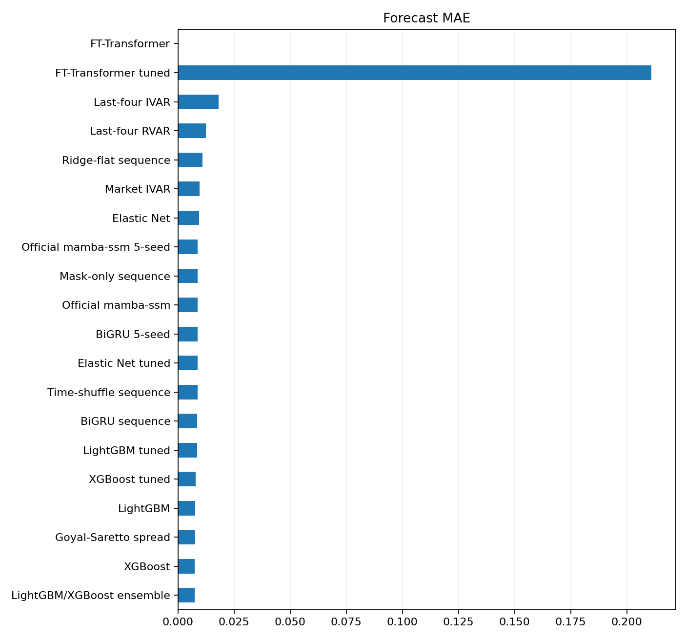
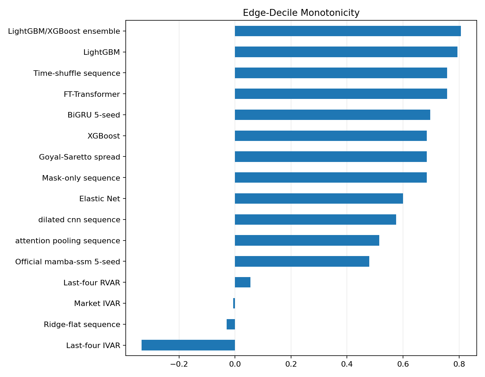
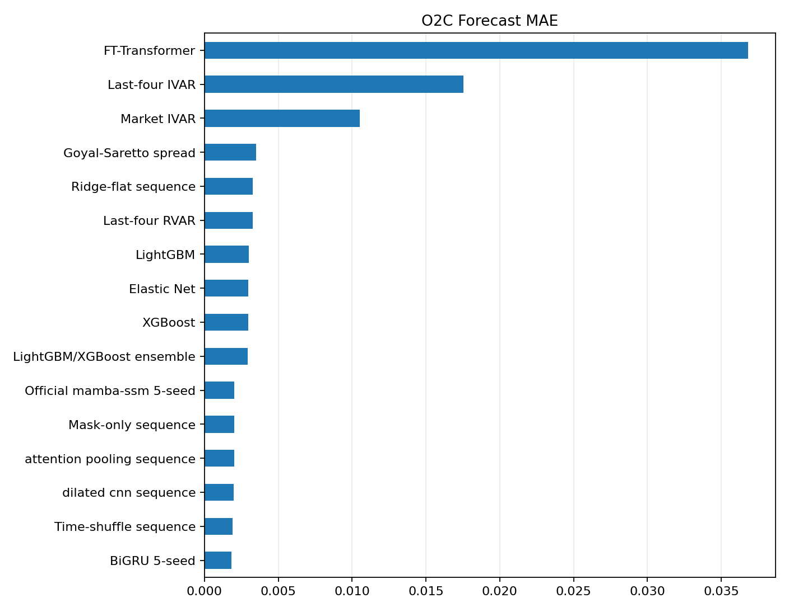
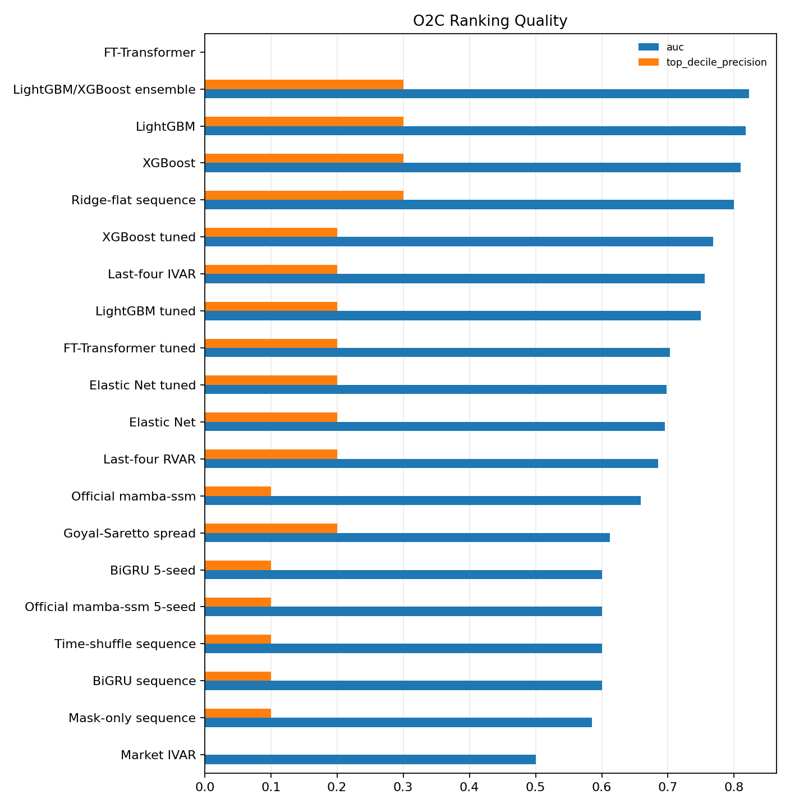
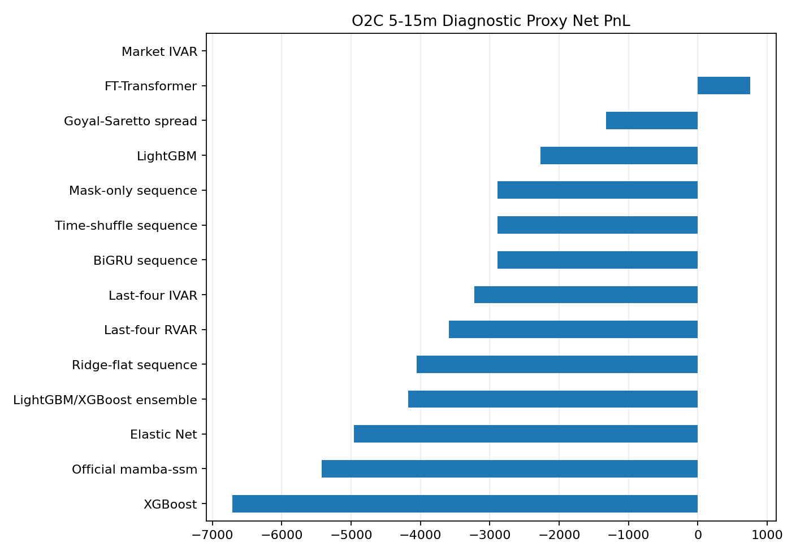
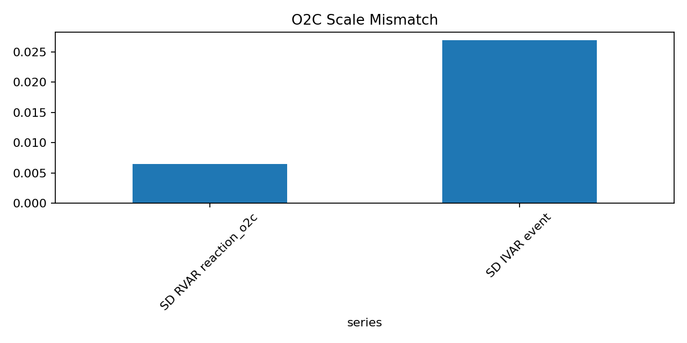
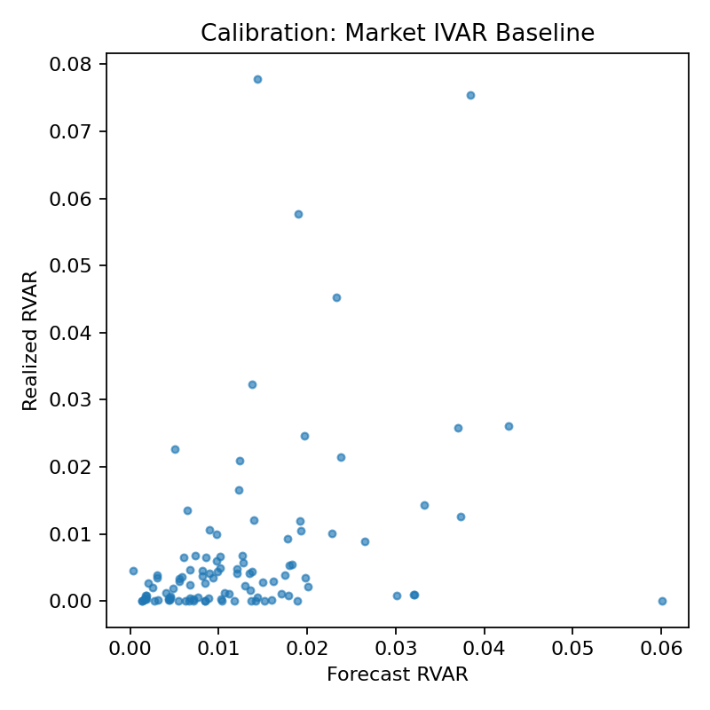
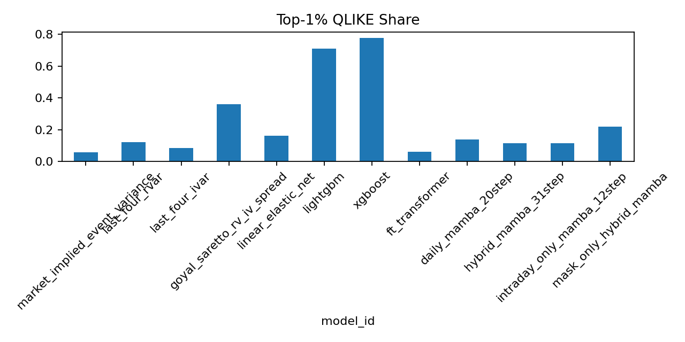

---
hide:
  - navigation
---

# Results and Discussion

This page is the paper-facing results ledger for the canonical local proxy
research package. It is written as the manuscript's `Results and Discussion`
section and should be read together with [Paper Plan](paper_plan.md).

Generated outputs remain under ignored `artifacts/`, `reports/`, and external
`DATA_DIR` locations. Selected figures are copied into
`docs/assets/images/modeling/`. The evidence grade is still
`no_nbbo_trade_proxy`: current option prices come from trade-aggregate proxy
marks, not quote midpoints, bid/ask records, OPRA, or NBBO.

This page is the handoff from the planned manuscript design to observed
evidence. Each completed experiment from the paper plan should appear here with
its sample, table or figure, outcome, interpretation, and claim boundary. The
goal is not to repeat every generated artifact verbatim; it is to make the
paper argument auditable by showing what was run, what won, what failed, and
what cannot yet be claimed.

## 3. Results and Discussion

This section follows the paper plan's experimental order. It first establishes
execution grade and sample coverage, then reports forecast and ranking results,
then premium-space proxy economics, then decomposition diagnostics, ablations,
cost and calibration checks, sequence gates, and finally the sellable claim and
remaining evidence requirements.

### 3.1 Execution Grade and Reproducibility Status

The repo has a complete proxy-stage research package: event panel, model
implementations, feature-schema artifacts, validation-only tuning artifacts,
forecast/ranking/strategy tables, figures, and analysis notes. It is good
enough for internal research review and a conservative working-paper draft. It
is not paper-grade execution evidence.

| Item | Current state |
| --- | --- |
| Verified local run | 2026-05-12 canonical tuned proxy package |
| Command | `just research args="--stage all --sequence-suite all --allow-high-sequence-risk --bootstrap-iter 1000 --tuning-profile tuned_phase1 --feature-schema-version fe_v2_sec_xbrl"` |
| Study window | 2022-12-01 to 2025-12-31 |
| Target paper window | 2013-2025, pending historical quote/NBBO or equivalent data |
| Universe | Monthly top 50 liquid U.S. single-name option underlyings |
| Timing sample | BMO and AMC earnings announcements |
| Split | Chronological event-level 70/15/15 |
| Tuning protocol | `tuned_phase1`, train/validation-only selection, locked test once |
| Feature schema | `fe_v2_sec_xbrl` default; `fe_v1_legacy` retained for ablation |
| Bootstrap iterations | 1,000 |
| Research manifest | `artifacts/modeling/research_manifest.json`, `ok=true` |
| Output report | `reports/modeling/proxy_research_report.md` |
| Ablation snapshots | `artifacts/modeling_ablations/fe_v2_sec_xbrl/`, `artifacts/modeling_ablations/fe_v1_legacy/` |

Reproducibility note: the results below are the canonical 2026-05-12 modeling
snapshot. A later data-DAG rebuild must pass cleanly before this page becomes a
final refreshed run ledger. Until quote/NBBO or equivalent data are added, all
strategy numbers must remain labeled `paper_grade=false`.

**Discussion.** The current result can be sold only as signal-screening
evidence. It cannot be sold as executable option-trading performance because
bid/ask crossing, quote availability, and NBBO routing are unavailable in this
data route.

### 3.2 Research Question and Evidence Map

The paper-facing question is:

> Can models improve trading decisions around option-implied earnings event
> variance mispricing?

Models forecast realized event variance. The market benchmark is
`IVAR_event`. Ex post mispricing is `RVAR_event - IVAR_event`. The strategy
layer converts predicted variance edge into premium-space expected edge and
proxy PnL.

| Target | Role in the paper | How it is interpreted |
| --- | --- | --- |
| `jump_c2o` | Primary scientific ranking target | Close-to-open earnings jump variance. Used for forecast, ranking, and tail-selection evidence. |
| `day_c2c` | V1 proxy-PnL headline | Close-to-close full reaction-day variance. Used for the main premium-space proxy strategy. |
| `reaction_o2c` | Diagnostic target | Open-to-close post-open digestion variance. Useful for decomposition and ranking diagnostics, not a headline IVAR-based strategy. |

The result hierarchy is:

| Evidence layer | Required conclusion discipline |
| --- | --- |
| Forecast fit | Report MAE, RMSE, and OOS R2 versus market IVAR, but do not sell RMSE alone. |
| Ranking | Sell only if AUC, top-decile precision, and edge-decile monotonicity improve. |
| Strategy proxy | Use `day_c2c` premium-space PnL as the V1 economic headline, with cost sensitivity. |
| C2O and O2C option-VWAP proxies | Treat as no-NBBO diagnostic decompositions. |
| Sequence models | Keep diagnostic unless they beat tabular baselines, mask-only controls, time-shuffle controls, and economics gates. |

The completed proxy-stage experiment ledger below is the bridge from
[Paper Plan](paper_plan.md) to the remaining results tables.

| Planned experiment | Results section | Primary evidence | Current outcome | Interpretation |
| --- | --- | --- | --- | --- |
| Execution-grade and sample audit | 3.1, 3.3 | Reproducibility table and coverage table | Modeling manifest is `ok=true`; current evidence remains `no_nbbo_trade_proxy`. | Complete proxy-stage package, not paper-grade execution. |
| Canonical FE V2 tuned package | 3.5, 3.6 | Main forecast/ranking table and C2C strategy table | FE V2 improves some level-fit rows but does not carry the economic claim. | FE V2 is a diagnostic default, not the sell. |
| Benchmark ladder | 3.4, 3.5 | Model-suite table and primary C2O metrics | Goyal-Saretto spread has best FE V2 `jump_c2o` AUC; market IVAR is the neutral baseline. | Classical baselines remain hard to beat. |
| Headline C2C proxy strategy | 3.6 | C2C ranking table and premium-space PnL table | FE V2 tabular rows are negative; ridge-flat sequence is positive but diagnostic. | Current FE V2 economics do not support a tabular headline. |
| C2O post-open diagnostics | 3.7 | C2O option-VWAP proxy table | Option-VWAP rows are small positive at best; intrinsic-open row is diagnostic only. | C2O is scientific/ranking evidence, not V1 executable PnL. |
| O2C decomposition diagnostics | 3.8 | O2C forecast/ranking table, proxy PnL table, scale diagnostic | O2C ranking works in places, but all strategy rows are headline-ineligible. | Useful decomposition, not a calibrated full-event strategy. |
| FE V1 versus FE V2 ablation | 3.9 | Feature-schema ablation table | FE V1 LightGBM/XGBoost is stronger on locked-test ranking and C2C proxy economics. | Main sell is parsimonious tabular signal screening. |
| Cost sensitivity | 3.10 | Cost multiplier table and figure | Only the FE V2 ridge-flat diagnostic row stays positive through 5x proxy haircut. | Cost robustness is not quote-execution evidence. |
| Calibration and QLIKE | 3.11 | Calibration and QLIKE diagnostic figures | Ranking evidence is stronger than calibrated variance-level evidence. | Supports the metric hierarchy from the paper plan. |
| Sequence diagnostic suite | 3.12 | Sequence diagnostic gate table | Official `mamba-ssm` does not beat controls or tabular baselines. | Do not sell Mamba or sequence superiority. |

The rest of this section expands those rows into manuscript-ready result
blocks. Each block distinguishes the numerical result from the interpretation
so a proxy-stage signal is not accidentally upgraded into an executable
trading claim.

### 3.3 Sample Construction and Coverage

The canonical modeling snapshot contains 810 BMO/AMC main-sample events. Of
these, 801 have a C2C realized-variance alias and 693 have a trade-proxy
`IVAR_event`.

| Measure | Value |
| --- | ---: |
| Dynamic-calendar rows | 1,054 |
| BMO/AMC main-sample candidates | 810 |
| Trade-proxy event-panel rows | 810 |
| Events with C2C `rvar_event` alias | 801 |
| Events with trade-proxy `IVAR_event` | 693 |
| Proxy contract candidates | 12,038 |
| Contracts with usable pre-cutoff proxy price | 10,165 |
| Contracts with no trade in cutoff window | 1,873 |
| Contracts with local IV proxy | 10,138 |
| Main DTE 5-14 contracts | 5,098 |
| Robustness DTE 3-21 contracts | 12,038 |
| Proxy straddle diagnostic rows | 779 |

Sequence coverage is weaker than tabular coverage: 678 of 810 events are
daily-sequence eligible, the drop rate is 16.3%, and
`high_sequence_selection_risk=true`. The active hybrid tensor is `31 x 21`: 19
prior daily proxy-surface states plus 12 entry-day five-minute trade-aggregate
proxy bins.

**Discussion.** The sample is large enough to run the complete proxy-stage
model suite, but not large or clean enough to support strong deep-sequence
claims. The 16.3% sequence drop rate is a selection-risk flag, so sequence
rows remain diagnostic.

### 3.4 Model Suite

The model suite covers market, historical, spread, tabular ML, neural tabular,
and sequence-diagnostic families.

| Family | Models | Status |
| --- | --- | --- |
| Market benchmark | Market-implied `IVAR_event` | Active neutral edge baseline |
| Historical baselines | Last-four RVAR, last-four IVAR | Active deterministic baselines |
| Classical spread benchmark | Goyal-Saretto-style RV-IV spread | Active comparator |
| Linear tabular | Elastic Net | `ElasticNetCV` |
| Nonlinear tabular | LightGBM, XGBoost | Validation-only tuning and train+validation refit |
| Ensemble | LightGBM/XGBoost rank-average | Equal-weight tuned-base ensemble |
| Neural tabular | FT-Transformer | Validation-tuned; not a current headline model |
| Sequence diagnostics | Ridge-flat aggregates, BiGRU 5-seed, official `mamba-ssm` 5-seed, attention pooling, dilated CNN, mask-only, time-shuffle | Diagnostic only |

**Discussion.** The benchmark design is strong enough for a working-paper
signal screen because it includes the main failure modes: market IVAR, simple
history, RV-IV spread, tuned GBDT, neural tabular, and sequence controls. The
main missing benchmark class for paper-grade execution is not another ML model;
it is quote/NBBO execution data.

### 3.5 Primary C2O Forecast and Ranking Results

Forecast and ranking columns use the primary `jump_c2o` target. The strategy
column in this same table uses `day_c2c`, the only V1 proxy-PnL headline, so
forecast quality and economic proxy quality can be compared side by side.

| Model | MAE | RMSE | OOS R2 vs IVAR | Top-decile precision | AUC | Day-C2C net proxy PnL |
|:---|---:|---:|---:|---:|---:|---:|
| Market IVAR | 0.0097 | 0.0145 | 0.000 | 0.000 | 0.500 | n/a |
| Last-four RVAR | 0.0123 | 0.0293 | -1.787 | 0.200 | 0.505 | -3,482 |
| Last-four IVAR | 0.0181 | 0.0540 | -0.295 | 0.200 | 0.468 | -15,904 |
| Goyal-Saretto spread | 0.0076 | 0.0134 | 0.141 | 0.300 | 0.602 | -461 |
| Elastic Net | 0.0099 | 0.0212 | 0.125 | 0.300 | 0.493 | -24,967 |
| LightGBM | 0.0097 | 0.0209 | 0.203 | 0.300 | 0.510 | -2,862 |
| XGBoost | 0.0099 | 0.0211 | 0.142 | 0.100 | 0.515 | -19,952 |
| LightGBM/XGBoost ensemble | 0.0098 | 0.0210 | 0.175 | 0.300 | 0.512 | -19,694 |
| FT-Transformer | 0.0357 | 0.0384 | -4.766 | 0.200 | 0.524 | -4,793 |
| Ridge-flat sequence | 0.0110 | 0.0221 | -0.047 | 0.200 | 0.434 | 19,918 |
| Attention pooling sequence | 0.0088 | 0.0236 | 0.054 | 0.100 | 0.480 | -2,238 |
| Dilated CNN sequence | 0.0088 | 0.0233 | 0.116 | 0.100 | 0.476 | -4,172 |
| BiGRU 5-seed | 0.0087 | 0.0236 | 0.059 | 0.200 | 0.472 | -8,022 |
| Official `mamba-ssm` 5-seed | 0.0088 | 0.0239 | 0.024 | 0.200 | 0.501 | -1,793 |
| Mask-only sequence | 0.0088 | 0.0242 | -0.039 | 0.100 | 0.500 | 101 |
| Time-shuffle sequence | 0.0086 | 0.0237 | 0.056 | 0.200 | 0.475 | -8,022 |






**Results.** For `jump_c2o`, LightGBM has the strongest OOS R2 versus IVAR
(0.203), while the Goyal-Saretto spread has the lowest MAE (0.0076) and best
ranking AUC (0.602). Top-decile precision is only 0.300 for the leading
non-sequence rows, so the ranking signal is preliminary rather than decisive.

**Discussion.** FE V2 is not the current sell. The strongest FE V2 primary
ranking result is a classical RV-IV spread, not the richer ML feature stack.
The tuned GBDT rows improve level fit but do not translate into strong C2O AUC
or C2C economics. This pushes the manuscript toward a conservative message:
the problem formulation and benchmark discipline are useful, but the default
FE V2 feature schema needs follow-up.

### 3.6 Headline C2C Proxy Strategy Results

The `day_c2c` strategy layer is the only V1 proxy-PnL headline because it uses
the full close-to-close event move and the pre-event option entry proxy. The
market IVAR row has no trades under the zero-edge premium rule.

Before the strategy conversion, the active FE V2 `day_c2c` forecast/ranking
rows show a mixed picture: the best ranking row is diagnostic sequence, while
the tuned tabular rows improve level fit only modestly.

| Model | AUC | Top-decile precision | OOS R2 vs IVAR | Interpretation |
|:---|---:|---:|---:|:---|
| Market IVAR | 0.500 | 0.000 | 0.000 | Neutral no-edge baseline. |
| Ridge-flat sequence | 0.636 | 0.500 | 0.264 | Best FE V2 C2C ranking/fit row, but sequence diagnostic. |
| Goyal-Saretto spread | 0.621 | 0.500 | -0.019 | Strong ranking comparator despite weak level fit. |
| Last-four RVAR | 0.571 | 0.400 | -2.248 | Some ranking signal but poor level fit. |
| LightGBM | 0.518 | 0.300 | 0.067 | Modest level improvement, weak ranking. |
| XGBoost | 0.512 | 0.300 | 0.023 | Modest level improvement, weak ranking. |
| LightGBM/XGBoost ensemble | 0.511 | 0.400 | 0.048 | Does not rescue FE V2 ranking. |

| Model | n | Net PnL | Return on premium | Sharpe | Max drawdown | Hit rate |
|:---|---:|---:|---:|---:|---:|---:|
| Market IVAR | 0 | n/a | n/a | n/a | n/a | n/a |
| Last-four RVAR | 100 | -3,482 | -0.0206 | -0.268 | -16,789 | 0.570 |
| Last-four IVAR | 100 | -15,904 | -0.0939 | -1.235 | -16,132 | 0.440 |
| Goyal-Saretto spread | 100 | -461 | -0.0027 | -0.036 | -17,145 | 0.590 |
| Elastic Net | 100 | -24,967 | -0.1474 | -1.956 | -27,384 | 0.430 |
| LightGBM | 100 | -2,862 | -0.0169 | -0.221 | -11,225 | 0.500 |
| XGBoost | 100 | -19,952 | -0.1178 | -1.556 | -22,298 | 0.440 |
| LightGBM/XGBoost ensemble | 100 | -19,694 | -0.1163 | -1.535 | -22,040 | 0.440 |
| FT-Transformer | 100 | -4,793 | -0.0283 | -0.370 | -15,366 | 0.320 |
| Ridge-flat sequence | 100 | 19,918 | 0.1176 | 1.557 | -7,338 | 0.610 |
| BiGRU 5-seed | 93 | -8,022 | -0.0505 | -0.634 | -15,709 | 0.591 |
| Official `mamba-ssm` 5-seed | 93 | -1,793 | -0.0113 | -0.141 | -13,038 | 0.602 |
| Attention pooling sequence | 93 | -2,238 | -0.0141 | -0.176 | -12,584 | 0.602 |
| Dilated CNN sequence | 93 | -4,172 | -0.0263 | -0.329 | -12,382 | 0.602 |
| Mask-only sequence | 93 | 101 | 0.0006 | 0.008 | -11,928 | 0.624 |
| Time-shuffle sequence | 93 | -8,022 | -0.0505 | -0.634 | -15,709 | 0.591 |


**Results.** Ridge-flat sequence is the best FE V2 C2C proxy-strategy row with
19,918 USD net proxy PnL and 11.8% return on premium. However, it is a
sequence diagnostic row, not a headline-eligible sequence claim. The best
non-sequence rows are weak or negative under FE V2.

**Discussion.** This table is the clearest reason FE V2 should not be sold as
the current economic result. Positive proxy economics exist in a diagnostic
sequence row, while the headline tabular FE V2 rows do not carry the result.
For a paper claim, the stronger same-code FE V1 ablation matters more than the
default FE V2 run.

### 3.7 C2O Post-Open Option-VWAP Diagnostics

The primary C2O option proxy uses same-contract option VWAP from 5 to 15
minutes after the regular-session open. The 0-5 minute VWAP is an opening
microstructure stress test. The intrinsic-open mark
`abs(open_after - strike) * 100` is a jump diagnostic only, not an option-price
exit.

| Proxy kind | Best model | n | Net PnL | Return on premium | Sharpe | Interpretation |
|:---|:---|---:|---:|---:|---:|:---|
| Intrinsic open diagnostic | Official `mamba-ssm` 5-seed | 93 | 28,898 | 0.1818 | 2.289 | Diagnostic only; not an option-price exit. |
| Post-open option VWAP 0-5 | LightGBM/XGBoost ensemble | 95 | 3,876 | 0.0229 | 0.378 | Opening microstructure stress proxy. |
| Post-open option VWAP 5-15 | FT-Transformer | 93 | 4,113 | 0.0243 | 0.380 | Primary C2O option-VWAP diagnostic mark. |

**Results.** The intrinsic-open diagnostic has the largest positive number,
but it is not executable option PnL. The primary 5-15 minute option-VWAP proxy
is positive only for FT-Transformer in the best-row summary, at 4,113 USD net
proxy PnL.

**Discussion.** C2O is useful scientifically because it isolates the overnight
earnings jump. It should not become the V1 economic headline until the project
has quote-based entry and exit marks and a clean option-price execution model.

### 3.8 O2C Post-Open Diagnostic Results

`reaction_o2c` is the post-open digestion target. Its realized variance is
post-open only, while `IVAR_event` is a full-event implied-variance comparator.
That makes O2C useful for ranking and decomposition diagnostics, not for
calibrated full-event mispricing claims.

| Model | n | MAE | RMSE | OOS R2 vs IVAR | Top-decile precision | AUC | Edge-decile Spearman |
|:---|---:|---:|---:|---:|---:|---:|---:|
| Market IVAR | 100 | 0.0105 | 0.0141 | 0.0000 | 0.0 | 0.500 | 0.079 |
| Last-four RVAR | 122 | 0.0033 | 0.0082 | 0.8770 | 0.2 | 0.685 | 0.964 |
| Last-four IVAR | 122 | 0.0175 | 0.0515 | -0.2597 | 0.2 | 0.755 | 0.321 |
| Goyal-Saretto spread | 100 | 0.0035 | 0.0067 | 0.7759 | 0.2 | 0.612 | 0.976 |
| Elastic Net | 122 | 0.0030 | 0.0082 | 0.9439 | 0.2 | 0.690 | 1.000 |
| LightGBM | 122 | 0.0030 | 0.0080 | 0.9422 | 0.2 | 0.721 | 1.000 |
| XGBoost | 122 | 0.0030 | 0.0081 | 0.9438 | 0.2 | 0.695 | 0.988 |
| LightGBM/XGBoost ensemble | 122 | 0.0029 | 0.0081 | 0.9448 | 0.2 | 0.714 | 0.988 |
| FT-Transformer | 122 | 0.0368 | 0.0373 | -5.7084 | 0.2 | 0.688 | 0.988 |
| Ridge-flat sequence | 122 | 0.0033 | 0.0086 | 0.9162 | 0.3 | 0.800 | 1.000 |
| BiGRU 5-seed | 100 | 0.0018 | 0.0035 | 0.9412 | 0.1 | 0.600 | 0.976 |
| Official `mamba-ssm` 5-seed | 100 | 0.0020 | 0.0037 | 0.9324 | 0.1 | 0.600 | 0.988 |
| Attention pooling sequence | 100 | 0.0020 | 0.0038 | 0.9292 | 0.1 | 0.596 | 0.988 |
| Dilated CNN sequence | 100 | 0.0020 | 0.0036 | 0.9360 | 0.1 | 0.596 | 1.000 |
| Mask-only sequence | 100 | 0.0020 | 0.0038 | 0.9274 | 0.1 | 0.585 | 0.988 |
| Time-shuffle sequence | 100 | 0.0019 | 0.0036 | 0.9373 | 0.1 | 0.600 | 0.988 |

| O2C proxy kind | Best model | n | Net PnL | Return on premium | Sharpe | Headline eligible |
|:---|:---|---:|---:|---:|---:|:---|
| 0-5 option VWAP to C2C exit | Goyal-Saretto spread | 95 | 227 | 0.0013 | 0.033 | False |
| 5-15 option VWAP to C2C exit | FT-Transformer | 93 | 753 | 0.0044 | 0.127 | False |

| O2C scale diagnostic | Value |
| --- | ---: |
| Paired rows | 693 |
| SD of `RVAR_event_reaction_o2c` | 0.0065 |
| SD of `IVAR_event` | 0.0269 |
| SD ratio, O2C to IVAR | 0.2399 |
| Mean ratio, O2C to IVAR | 0.1672 |









**Results.** Ridge-flat sequence has the best O2C ranking AUC at 0.800, and
FT-Transformer has the best 5-15 minute O2C diagnostic proxy PnL at 753 USD.
All O2C strategy rows are `pnl_headline_eligible=false`.

**Discussion.** O2C validates that the target decomposition is informative,
but it is not the core economic claim. The scale diagnostic shows why
full-event `IVAR_event` is a weak comparator for post-open realized variance:
O2C variance is much smaller than full-event IVAR in the paired sample.

### 3.9 FE V1 Versus FE V2 Feature-Schema Ablation

The same-code ablation is the most important current manuscript diagnostic.
The richer default FE V2 schema does not dominate the parsimonious FE V1
schema.

| Feature schema | Target | Best AUC model | Best AUC | Best OOS R2 model | Best OOS R2 vs IVAR | Best headline/diagnostic PnL model | Best net PnL |
|:---|:---|:---|---:|:---|---:|:---|---:|
| `fe_v1_legacy` | `jump_c2o` | LightGBM | 0.677 | XGBoost | 0.375 | Official `mamba-ssm` 5-seed, C2O intrinsic diagnostic | 28,898 |
| `fe_v1_legacy` | `day_c2c` | LightGBM | 0.925 | XGBoost | 0.574 | LightGBM, C2C headline | 53,664 |
| `fe_v1_legacy` | `reaction_o2c` | Ridge-flat sequence | 0.799 | XGBoost | 0.949 | FT-Transformer, O2C diagnostic | 643 |
| `fe_v2_sec_xbrl` | `jump_c2o` | Goyal-Saretto spread | 0.602 | LightGBM | 0.203 | Official `mamba-ssm` 5-seed, C2O intrinsic diagnostic | 28,898 |
| `fe_v2_sec_xbrl` | `day_c2c` | Ridge-flat sequence | 0.636 | Ridge-flat sequence | 0.264 | Ridge-flat sequence, C2C headline | 19,918 |
| `fe_v2_sec_xbrl` | `reaction_o2c` | Ridge-flat sequence | 0.799 | LightGBM/XGBoost ensemble | 0.945 | FT-Transformer, O2C diagnostic | 753 |

**Results.** FE V1 dominates the current headline C2C economic row: FE V1
LightGBM reaches 53,664 USD net proxy PnL, while FE V2's best C2C row is a
diagnostic ridge-flat sequence at 19,918 USD. FE V1 also has stronger
`jump_c2o` AUC and OOS R2 in the same-code screen.

**Discussion.** The paper should not claim that FE V2 improves the result.
Instead, FE V2 should be presented as a richer feature experiment with a
negative current outcome. The sellable result is narrower: a parsimonious
event-level feature set has preliminary signal, and richer SEC/XBRL features
need feature diagnostics, regularization, or more data before becoming the
headline.

### 3.10 Cost Sensitivity

The default cost model is a proxy haircut:

```text
proxy_cost_usd = 0.005 * entry_premium_usd
```

Multiplier 0 is an anchor, multiplier 1 is the default proxy assumption, and
multipliers 3 and 5 are stress tests. Because true bid/ask costs are
unavailable, this table is a proxy stress test rather than an execution-cost
estimate.

| Model | 1x cost | 3x cost | 5x cost |
|:---|---:|---:|---:|
| Goyal-Saretto spread | -461 | -2,155 | -3,849 |
| LightGBM | -2,862 | -4,556 | -6,250 |
| XGBoost | -19,952 | -21,646 | -23,340 |
| LightGBM/XGBoost ensemble | -19,694 | -21,388 | -23,082 |
| Ridge-flat sequence | 19,918 | 18,224 | 16,530 |
| Official `mamba-ssm` 5-seed | -1,793 | -3,383 | -4,972 |


**Results.** The only FE V2 row that remains positive through the 5x proxy
haircut stress is ridge-flat sequence, again with diagnostic status. The main
tuned tabular rows remain negative under the default FE V2 schema.

**Discussion.** Cost sensitivity reinforces the evidence boundary. Positive
proxy PnL that survives a haircut stress is not equivalent to quote-executable
PnL. The next paper-grade run must estimate entry and exit costs from quote or
NBBO data.

### 3.11 Calibration and QLIKE Diagnostics

Calibration checks whether forecasted event-jump variance is on the same scale
as realized event-jump variance, not only whether the model sorts events.
QLIKE is kept as a diagnostic because near-zero forecasts dominate raw
contributions for some rows.





**Results.** The current evidence is stronger for ranking than for perfectly
calibrated variance levels. Raw QLIKE is too sensitive to near-zero values to
serve as the headline metric in this sample.

**Discussion.** This supports the metric hierarchy in the paper plan: MAE,
RMSE, and OOS R2 are necessary but insufficient; AUC, top-decile precision,
edge-decile monotonicity, and premium-space proxy PnL are closer to the
research question.

### 3.12 Sequence Diagnostic Gate

No sequence model passes the diagnostic gate. Official `mamba-ssm` is now
implemented through the `mamba-ssm` backend and appears in the artifacts, but
the 5-seed row does not beat tabular baselines or controls robustly enough to
upgrade the claim.

| Diagnostic | Current result |
| --- | --- |
| Sequence coverage | 678 eligible events out of 810 |
| Drop rate | 16.3% |
| Selection risk flag | `high_sequence_selection_risk=true` |
| Official `mamba-ssm` `jump_c2o` AUC | 0.501 |
| Mask-only `jump_c2o` AUC | 0.500 |
| Official `mamba-ssm` `day_c2c` net PnL | -1,793 |
| Mask-only `day_c2c` net PnL | 101 |
| Mamba-mask forecast correlation on common C2O rows | 0.092 |
| Mamba-realized `jump_c2o` correlation | 0.101 |
| Mask-realized `jump_c2o` correlation | 0.021 |

**Results.** The sequence suite contains useful diagnostics, but not a
headline sequence or Mamba result. The ridge-flat positive C2C row is not
enough to overcome the sequence coverage and control gates.

**Discussion.** The manuscript should not claim Mamba superiority. The
sequence suite can be sold as a rigorous negative/diagnostic test: ordered
proxy-surface paths are implemented and evaluated, but the current sample does
not show reliable incremental value beyond simpler baselines.

### 3.13 Current Sellable Claim

The defensible near-term claim is:

> In a no-NBBO proxy sample, a parsimonious event-level tabular feature set
> shows preliminary cross-sectional signal for earnings event-variance
> mispricing beyond market IVAR and simple historical baselines. The richer FE
> V2 schema and sequence models are currently diagnostic rather than headline
> evidence.

The current paper angle should emphasize:

- the trading question is event-variance mispricing, not generic IV
  forecasting;
- ranking and top-decile selection matter more than unconditional RMSE;
- FE V1 tabular LightGBM/XGBoost is the stronger same-code signal screen;
- FE V2, sequence models, and Mamba are diagnostic rather than headline
  evidence;
- all current market-trade results are no-NBBO trade-aggregate proxy results.

### 3.14 Claim Boundaries and Required Next Evidence

Do not claim:

- paper-grade executable performance;
- bid/ask, quote-mid, OPRA, or NBBO execution;
- Mamba or sequence-model superiority;
- FE V2 improvement;
- that lower RMSE alone implies economic value;
- that C2O or O2C diagnostic rows are the V1 economic headline.

Paper-grade claims require:

| Requirement | Why it is needed |
| --- | --- |
| Historical quote/NBBO or equivalent data | Converts no-NBBO proxy marks into executable entry/exit evidence. |
| Quote-based `IVAR_event` construction | Replaces trade-close IV proxies with quote-consistent implied variance. |
| Leg-level execution and realistic bid/ask crossing | Converts premium-space proxy edge into executable PnL. |
| Longer historical sample | Supports stronger inference, liquidity stratification, and crisis/regime checks. |
| DTE and liquidity robustness | Tests whether results survive contract-selection choices. |
| Clustered/bootstrap inference over final sample | Separates stable cross-sectional signal from small-sample luck. |

**Bottom line.** The project has all code paths and proxy-stage results needed
for an internal working-paper draft. It does not yet have the final data
quality or execution evidence needed for a submission-level empirical finance
paper.
